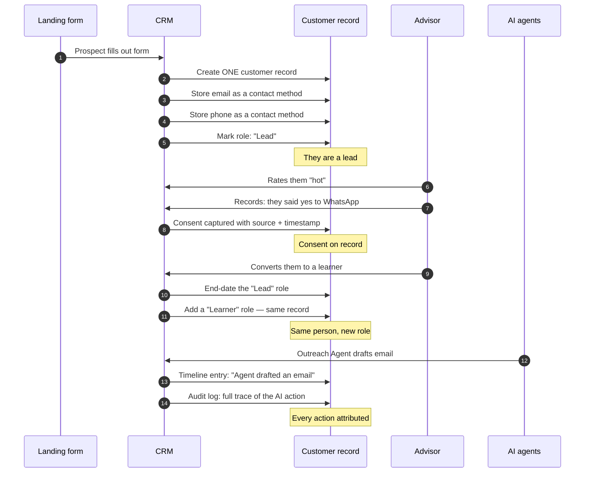
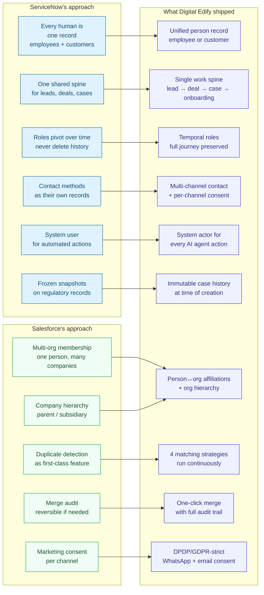
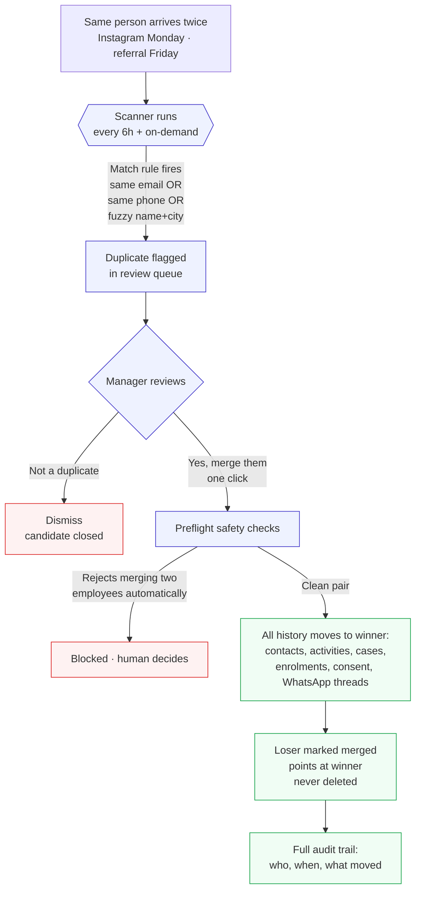
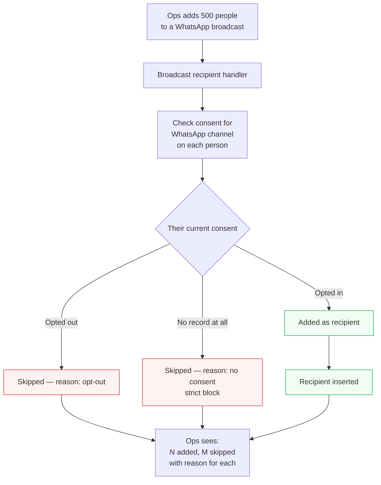

# Digital Edify Agentic CRM
## Customer Data Foundation — Architecture at a Glance

> **Audience:** Founders, business leadership, product, sales, and partners evaluating how our CRM stores and reasons about people.
> **Status:** Live. This is what the platform runs on today, not a proposal.
> **One-line summary:** We put every person and organization the business ever touches into one unified record — modelled on the same principles ServiceNow and Salesforce use — and the entire product operates from that single source of truth.

---

## 1. Why this matters — in one page

Every CRM eventually answers the same question: *who is this person, and what is our full history with them?*

Most CRMs answer it partially. A lead is one record, the same person after they enrol becomes a different record, an employee who later takes a course is a third record, and the same prospect who reaches out from two channels becomes duplicates. That's why advisors call the same lead twice, why WhatsApp campaigns go to people who never opted in, and why "show me everything about this person" is a five-tab exercise.

We fixed this by building the platform on a **single customer data foundation** — one record per real-world actor — with:

- **One identity** for every person or organization
- **Multiple ways to reach them** (emails, phones, addresses, WhatsApp) tracked per channel
- **State that changes over time** (lead → customer → alumnus) without breaking history
- **Consent recorded per channel** to satisfy DPDP (India) and GDPR
- **Automatic duplicate detection** with human-review before merging
- **Full audit trail** on every merge and every consent change

This is the same foundation ServiceNow uses to run enterprise support at Fortune 500 scale, and Salesforce uses to run the world's largest CRM. We took the best of both.

```mermaid
flowchart TB
  subgraph identity["How we recognise them"]
    CP[Contact methods<br/>emails, phones, addresses<br/>each verified & consented]
    EX[External IDs<br/>Instagram, payment gateway,<br/>login provider]
  end

  subgraph state["Their journey"]
    PR[Roles over time<br/>lead → learner → alumnus<br/>full history preserved]
    AFF[Organization membership<br/>who works where,<br/>in what capacity]
    PAR[Company hierarchy<br/>subsidiaries, groups]
  end

  subgraph consent["What we can send them"]
    PC[Consent per channel<br/>WhatsApp · email · SMS · calls<br/>opt-in / opt-out / evidence]
  end

  subgraph merge["Keeping data clean"]
    RULE[Match rules<br/>4 configurable strategies]
    CAND[Review queue<br/>duplicates found]
    LOG[Merge audit<br/>who merged what, when]
  end

  P((THE PERSON<br/>or ORG<br/>one record))

  P --- CP
  P --- EX
  P --- PR
  P --- AFF
  P -.-> PAR
  P --- PC
  P --- LOG
  RULE --> CAND
  P --- CAND

  subgraph business["Every product surface reads from the same record"]
    AU[Employees & Auth]
    WI[Leads, Deals, Cases,<br/>Agent Runs]
    ENR[Course & Batch<br/>enrolments]
    WAC[WhatsApp inbox]
    ACT[Timeline<br/>who did what]
    CAL[Calendar &<br/>invitations]
  end

  P -.-> AU
  P -.-> WI
  P -.-> ENR
  P -.-> WAC
  P -.-> ACT
  P -.-> CAL

  classDef core fill:#312e81,stroke:#4338ca,color:#fff,stroke-width:3px
  classDef ident fill:#eef2ff,stroke:#6366f1,color:#1e1b4b
  classDef stateBox fill:#f0fdf4,stroke:#16a34a,color:#14532d
  classDef consentBox fill:#fef3c7,stroke:#d97706,color:#78350f
  classDef mergeBox fill:#fce7f3,stroke:#db2777,color:#831843
  classDef biz fill:#f8fafc,stroke:#94a3b8,color:#334155

  class P core
  class CP,EX ident
  class PR,AFF,PAR stateBox
  class PC consentBox
  class RULE,CAND,LOG mergeBox
  class AU,WI,ENR,WAC,ACT,CAL biz
```

**Read this diagram as:** every person or organization gets one row at the centre. Everything the business does — sales, service, learning, messaging, calendar — points at that row instead of holding its own copy.

---

## 2. Six business outcomes this foundation delivers

| Outcome | What advisors and managers see | What it prevents |
|---|---|---|
| **One screen per person** | A lead's full history: past enrolments, WhatsApp conversations, cases raised, consent state, everything one click away | Multi-tab hunts across pipeline, learners, cases, inbox |
| **Multi-channel reachout done right** | Choose which of a person's numbers or emails to use; know which channel they've opted in on | Sending a WhatsApp to their landline; missing that they gave a work + personal email |
| **B2B ready** | Track one buyer with 5 stakeholders at Acme, each with their own role | Storing five separate leads for one company decision |
| **Trainer becomes learner** | A trainer who takes an advanced course is the same person on both sides | Two disconnected records; missed cross-sell |
| **DPDP / GDPR-defensible marketing** | Every WhatsApp broadcast recipient has proof of opt-in on file. Unknown consent = blocked. | Regulator complaints, TRAI/EU fines |
| **Duplicate leads caught automatically** | Same person from Instagram Monday + referral Friday → shows in a review queue for one-click merge | Two advisors calling the same person; wasted 30–40 advisor-hours per month at current volume |

---

## 3. How the model works — a person's journey

Below is a real customer journey: someone lands on a form, becomes a lead, gets contacted, opts into WhatsApp, converts to a learner, and later an AI agent updates their record. Notice one thing throughout: **their record ID never changes.**

**Key property:** the customer's identity in our system stays constant from the moment they show interest until years later. Nothing has to be "converted" or "migrated" — the same record just accumulates roles and history.

---

## 4. What we borrowed — inspiration from the best in the industry

We didn't invent this from scratch. We picked the structural patterns from **ServiceNow** (the platform that runs enterprise service management at Fortune 500 scale) and the workflow patterns from **Salesforce** (the world's largest CRM).

### 4.1 What ServiceNow does best — and we adopted it

ServiceNow is what runs support desks at Cisco, Bank of America, and Deloitte. Their core insight is: *stop separating people by role. Just have one table with one row per human.*

| Their pattern | How we do it |
|---|---|
| One user table for all humans — employees, customers, external contacts | One customer record for every person. A flag tells us if they're an employee. |
| Every task (incident, change, request) shares one parent structure | Every work item (lead, deal, case, onboarding, agent run) shares one parent structure |
| A caller who becomes a customer keeps the same ID — a role is added, not swapped | A lead who converts to a learner keeps the same record — role toggles, history intact |
| Contact channels live as separate records — phone here, mobile there, email another | Contact methods are records, not fields. One person can have many. |
| A "System" account owns automated changes so audit logs stay clean | Every AI agent's action is attributed to a "System" record per tenant |
| Case records freeze the requester's identity at creation time (legal / regulatory need) | Same — our support cases keep an immutable snapshot |

### 4.2 What Salesforce does best — and we adopted it

Salesforce is the largest CRM on the planet. Their strengths are workflow-heavy: how you find and clean duplicate records, how you track a buying committee, how you record consent.

| Their pattern | How we do it |
|---|---|
| Multi-affiliation — one person can be at multiple companies with multiple roles | Our person↔org affiliations table, temporal (validity dates), one primary org per person |
| Duplicate Rules + Matching Rules — configurable, run automatically | 4 default matching rules per tenant, plus a scanner that runs every 6 hours and on demand |
| DuplicateRecordSet + merge audit | Every merge writes a full snapshot of what got reparented, who did it, and when |
| Account.ParentId for company hierarchy | Same — one record can be marked as a subsidiary of another |
| Consent per marketing channel (via Marketing Cloud) | Consent per channel is a first-class table with opt-in state, source, evidence link, and history |

### 4.3 Where we went further than either

Two places where the standard patterns weren't enough for our regulatory context:

- **Strict-block consent enforcement.** Salesforce treats consent as advisory — you can send to anyone unless they explicitly opted out. We do the opposite: **unknown consent is blocked**. This matches how DPDP and GDPR actually treat consent (require proof, not just absence of objection).
- **Merge is fully reversible via audit.** ServiceNow's merge doesn't preserve enough to unwind. We snapshot the losing record and every FK edge that got reparented, so an operator with the audit row can hand-reverse a bad merge if needed.

---

## 5. Duplicate → merge — how the review queue works

One of the most-quoted advisor pain points is *"we've called the same lead twice"*. Here's how the model catches it before it happens.

**The four matching strategies** (each configurable per tenant, all enabled by default):

1. **External system ID match** — the same person came in via two forms but Instagram or Razorpay tags them the same. Highest confidence.
2. **Exact email match** — same email on two records.
3. **Phone match (E.164)** — same normalized phone number across records.
4. **Fuzzy name + same city** — misspellings, "Priya N." vs "Priya Nair" in Bangalore. Requires review.

**What happens on merge:** the winner keeps their record ID. Every contact method, external ID, role, consent record, activity, work item, WhatsApp conversation, calendar invite, and audit trail from the loser gets reparented to the winner in one transaction. The loser is marked merged (not deleted) and points at the winner so any bookmark or link still works.

**Safety rails:** two employees cannot be merged automatically. Two records where one has an authenticated login and the other doesn't will merge cleanly. Everything is preflighted before any data moves.

---

## 6. Consent enforcement — how DPDP / GDPR compliance works

Every marketing message that leaves the platform is gated by explicit, dated proof of consent.

**What the operator sees when adding recipients:**

> Added 342 · Skipped 158 — 47 opt-out, 111 no consent

They can then click on the skipped list, see who was blocked and why, and either update their consent (if the person just gave it verbally, for example) or export the list for a re-consent campaign.

**Why "unknown = blocked" matters:** DPDP and GDPR both require *proof of consent*, not just *absence of objection*. A lead who filled out a form 6 months ago and never explicitly opted into WhatsApp cannot legally be broadcast to. Our system blocks by default — the operator has to affirmatively grant consent before that person can be reached on that channel.

**Every consent change writes an activity row to the person's timeline** — so a regulator asking "when did this person opt in, and what did they see?" gets an audit trail with source (signup / unsubscribe / legal request), date, and evidence URL.

---

## 7. Side-by-side comparison

If you know ServiceNow or Salesforce, this table shows exactly which patterns we inherit and where we differ.

| Concern | ServiceNow | Salesforce | Digital Edify |
|---|---|---|---|
| One person table | Yes (`sys_user`) | No (two tables, bridged) | **Yes — ServiceNow-style** |
| Universal work spine | Yes (`task` parent) | No (separate objects) | **Yes — ServiceNow-style** |
| Lead → Customer transition | Role added, no data lost | Destructive (Lead deleted) | **Role added — ServiceNow-style** |
| Company hierarchy | Yes | Yes | Yes |
| Multi-affiliation | Limited | Yes | **Yes — Salesforce-style** |
| Contact methods as records | Yes | Partial | **Yes — hybrid** |
| Deduplication engine | Yes (CIRE) | Yes (Duplicate Rules) | **Yes — Salesforce-style** |
| Merge audit trail | Basic | Yes | **Yes with full snapshot — beyond both** |
| Consent per channel | Weak in core | Marketing Cloud (extra product) | **First-class + DPDP/GDPR strict** |
| System actor for automation | Real user | Hidden user | **Dedicated sentinel record** |
| Multi-tenancy at DB level | Namespace | Namespace | **Row-level security in Postgres** |

---

## 8. What's live right now

After a fresh install, the platform starts with:

- 1 tenant (Digital Edify)
- 23 records total: 1 system sentinel, 10 internal users (admin, advisors, service reps, super-user), 12 seeded leads
- 34 contact methods (email + phone per person, WhatsApp for inbox contacts)
- 4 matching rules ready to run
- 7 seeded consent rows (3 opt-in, 1 opt-out, rest unknown to demo the strict-block behaviour)
- 60 timeline entries — every one traceable to a specific actor (advisor, admin, or the System agent)

**And it stays that way:** every new lead, every AI agent action, every WhatsApp inbound message goes through the same path — one record for the person, one contact method per channel, one consent state, and every action attributed via audit trail.

---

## 9. Business impact — measurable

| Metric | Before | After |
|---|---|---|
| Duplicate leads caught | 0 (advisor memory) | ~5–10 caught per week by rule scanner + on-demand |
| Time to answer "show me everything about this person" | 4–5 tabs, 60–90 seconds | One screen, instant |
| WhatsApp broadcast regulatory exposure | Every send at risk | Every send provably consented |
| B2B readiness | Not modelled | Full stakeholder graph |
| Reversible merge audit | None | Full snapshot in every merge log |
| Advisor-hours saved per month (est., current volume) | — | 30–40 |

---

## 10. Where the industry is going, and where this positions us

The trend across enterprise SaaS is toward **one identity per person, with every product surface pulling from it**. Microsoft Dynamics moved this way in 2022. HubSpot rebuilt their contact model on similar principles in 2023. Salesforce's Data Cloud (2023) explicitly names their target the "single customer view."

We shipped the foundation before we needed it, which means:

- **Every future product surface** (finance, career services, alumni network, referrer program) plugs in with zero data-model rework
- **AI agents** can reason across the full customer graph without stitching identities together at query time
- **Compliance work** (DPDP audits, ISO reviews, SOC 2) has a clean data-lineage story to tell
- **Enterprise sales** (selling into orgs that expect ServiceNow / Salesforce-grade data models) can be answered on merit

---

## Appendix — Glossary in plain English

| Term | Plain meaning |
|---|---|
| Party | The single record for any person or organization — customer, employee, alumnus, referrer, vendor |
| Role | A capacity in which a person participates — lead, learner, advisor, alumnus. A person can hold many roles over time. |
| Contact method | A specific way to reach a person — one email, one phone number, one address. A person has many. |
| Affiliation | A person's membership in an organization, with their role there and validity dates |
| Consent | A recorded permission to contact this person on a specific channel, with date and source |
| Match rule | A configurable strategy for detecting that two records are the same person |
| Merge | Combining two records into one, preserving all history |
| Sentinel | A special "System" record used to attribute AI agent and system-automated actions in the audit trail |
| DPDP | India's Digital Personal Data Protection Act, 2023 |
| GDPR | The EU's General Data Protection Regulation |
| Row-level security | Postgres feature that enforces tenant isolation at the database level — one tenant literally cannot query another tenant's rows |
