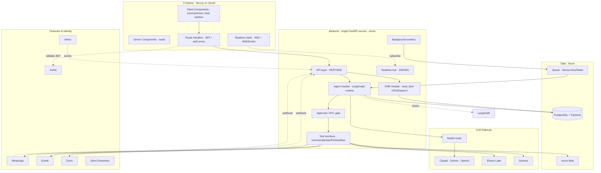
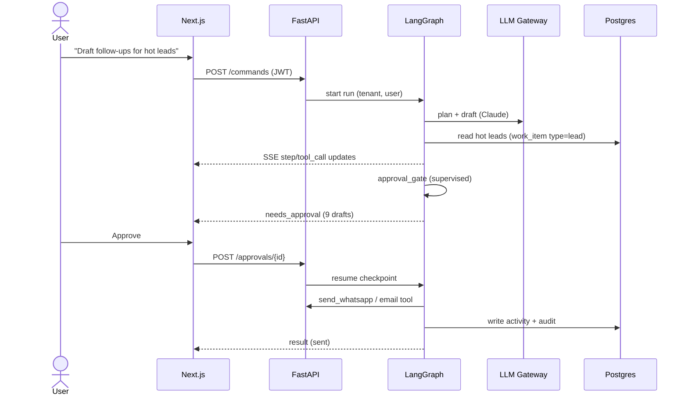

# Digital Edify Agentic CRM — Application Architecture

**Version:** 2.0 (consolidated) · Sales + Service · Agent-first
**Foundations:** Postgres-only data layer · single FastAPI backend · Next.js frontend · ServiceNow-style single data model · human-in-the-loop agents.

---

## 1. Architectural posture

This is an **agent-first CRM**: the primary interface is a command box and an agent activity feed, not a record grid. Records, pipeline, and lists sit behind that. Three rules govern every component:

1. **Humans approve, agents execute** — every consequential action passes a human-in-the-loop (HITL) gate (auto / supervised / manual per action type).
2. **Agents are graphs, not prompts** — each agent is a stateful, resumable, observable LangGraph workflow.
3. **One model, one engine** — everything actionable is a `work_item`; everyone is a `party`; one orchestration engine (LangGraph + approval gate) serves all domains.

---

## 2. Component overview



---

## 3. Frontend (Next.js · React · TypeScript)

**Rendering strategy.** Server Components for reads (lists, record views, pipeline snapshots) — fast, cacheable, close to the data. Client Components for the interactive agent surfaces (command box, live feed, kanban drag, approval buttons).

**Surfaces (from the prototype):**

| Surface | Type | Data source |
|---|---|---|
| Agent Home + command box | Client | POST intent → agent planner; stream steps via SSE |
| Active agents grid | Server + WS | `agent_run` work items; live status over WebSocket |
| Activity feed + approvals | Server + WS | `activity` timeline; approve → HITL endpoint resumes the run |
| Leads / Pipeline | Server (RSC) + optimistic client | `work_item` (type=lead/deal) |
| Record (360°) | Server | `party` + `work_item` + `relationship` graph + timeline |
| Inbox / Service | Server + WS | `work_item` (type=service_case) |

**Real-time protocol.** Two channels: **SSE** streams a single agent run's steps into the command box (`step`, `tool_call`, `needs_approval`, `result`); a per-user **WebSocket** topic pushes feed items and agent-status changes. Typed events only.

**BFF.** Next.js Route Handlers validate the Auth0 session, attach tenant/user context, and proxy to FastAPI. No standalone Node service.

**Design system.** Tokenize the prototype's language (Inter Tight / Instrument Serif, blue→violet→magenta gradient, icon rail + sidebar) so agent-generated content renders consistently.

---

## 4. Backend (single FastAPI service)

One Python service, modular by responsibility:

### 4.1 API layer
REST for CRUD/search/commands; SSE endpoints for run streaming; webhook receivers for inbound channels. OpenAPI-described; typed clients generated for the frontend. Every request carries `tenant_id` + user identity (from the validated JWT) and sets the Postgres session GUC `app.tenant_id` for row-level security.

### 4.2 CRM module
Operations over the single data model: create/read/update/search `work_item` and its extensions, resolve/merge `party`, traverse `relationship` for the 360° view, move pipeline cards (state transitions validated against the state model). Writes go through a thin service layer that emits an `activity` event and an `audit_log` row for every change.

### 4.3 Agent module (LangGraph runtime)
Each agent is a graph:

```
plan → retrieve_context (RAG) → call_tools → draft →
approval_gate → execute → write_back → report
```

- **State** is checkpointed (to Postgres) so runs are **resumable** — an agent paused at `approval_gate` resumes exactly there on approval.
- **Catalog** (operate on work items by type):
  - *Sales:* Lead Scoring (`lead`), Outreach (`lead`/`deal`), Scheduler (`deal`), Forecast (cohort/pipeline).
  - *Service:* Triage (`service_case`), Onboarding (`onboarding_task`), Retention (engagement signals).
- **Deep Agents** only for open-ended command-box goals (planner + sub-agents); fixed graphs for narrow repeatable jobs.
- **Memory:** run state (checkpoint) · entity memory (`party`/`work_item` + summarized notes) · semantic memory (PgVector, retrieved at `retrieve_context`).

### 4.4 Approval / HITL gate
A shared graph node every consequential action passes through. A per-tenant, per-action policy table decides `auto` / `supervised` / `manual`. Pending items become `approval` rows surfaced in the feed; a decision resumes the checkpointed graph. Default consequential actions to **supervised** until eval data justifies loosening.

### 4.5 Tool functions
Plain, typed Python functions — the seam that later becomes MCP tools:
`send_whatsapp`, `place_call (Exotel)`, `book_meeting (Zoom)`, `retrieve_kb (PgVector RAG)`, `generate_deck (Gamma)`, `synthesize_voice (Eleven Labs)`, `update_work_item`, `move_stage`. Each tool: typed I/O, tenant/user scoping, audit logging, and an `requires_approval` flag.

### 4.6 Background workers + queue
Long agent runs are dispatched to the queue (Azure Service Bus or Redis); workers execute graphs and emit progress to the realtime hub. The API returns a `run_id` immediately. This is what makes "Re-engage 14 cold no-shows" run in the background and report into the feed.

### 4.7 Realtime hub
Holds SSE/WebSocket connections; fans run-progress and feed events to subscribed users. Backed by Redis pub/sub so it works across multiple backend instances.

---

## 5. LLM gateway

All providers sit behind one gateway (routing, fallback, cost accounting, PII redaction, prompt-injection screening, JSON-schema validation of any model output that writes to the DB).

| Task | Model |
|---|---|
| Agent planning / tool use | Claude (Opus/Sonnet) |
| High-volume scoring/classification | Gemini Flash / small OpenAI |
| Drafting / personalization | Claude / OpenAI |
| Embeddings | OpenAI / Gemini → PgVector |
| Voice | Eleven Labs |
| Decks / docs | Gamma (API) |

---

## 6. Channel integration

Inbound channel webhooks (WhatsApp, Exotel, Vimeo events) hit FastAPI receivers, normalize to a **canonical event**, persist to `activity`, and notify the relevant agent. Outbound actions are tool functions. N8N is **optional**, added later only for no-code third-party glue — never for business logic.

| Channel | Direction | Mechanism |
|---|---|---|
| WhatsApp | both | out: tool · in: webhook → event → triage/outreach agent |
| Exotel | both | out: click-to-call tool · in: recording → Blob, transcript → activity → embeddings |
| Zoom | out | scheduler tool books; recording/transcript ingested to timeline |
| Vimeo | in | watch events → Retention agent signals |
| Omni Dimension + Eleven Labs | both | voice agent front end + TTS, logic in the agent layer |

---

## 7. Key flows

### 7.1 Command-box intent → action


### 7.2 Inbound service message → triage
Webhook → canonical event → `activity` + open/append `service_case` work item → Triage Agent (RAG over policies + learner history) drafts reply → approval gate → send → write back → feed update.

---

## 8. Cross-cutting

- **AuthN/Z (Auth0):** RBAC roles (Admin, Advisor, Service Rep, read-only). Agents act *on behalf of* the initiating user — tool calls authorized against that user's permissions; no super-user agent.
- **Observability (LangSmith):** every run traced (steps, tool calls, tokens, cost, latency) from day one; eval datasets gate prompt/graph changes in CI.
- **Audit:** immutable `audit_log` row for every agent action — context, model, approver. Accountability backbone.
- **Multi-tenancy:** `tenant_id` everywhere + Postgres RLS; built in even for a single tenant.
- **Compliance (DPDP):** consent capture for channels, India-region data residency, PII kept out of prompts (gateway redaction), call-recording consent.

---

## 9. Service responsibilities summary

| Concern | Owner |
|---|---|
| UI, BFF, auth session | Next.js (Vercel) |
| CRM CRUD, search, 360° | FastAPI · CRM module |
| Agent reasoning, tools, HITL | FastAPI · Agent module |
| Long-running work | Workers + queue |
| Model calls | LLM gateway |
| System of record + vectors | PostgreSQL + PgVector |
| Files/recordings | Azure Blob |
| Identity | Auth0 |
| Tracing/eval | LangSmith |

The system stays at **one frontend, one backend service, one database** — scale comes from the data model's shape (next document) and the agent engine's reuse across domains, not from more infrastructure.
