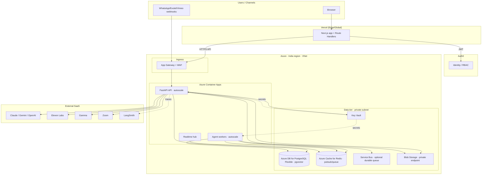
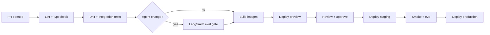

# Digital Edify Agentic CRM — Infrastructure Architecture

**Version:** 2.0 · Frontend on Vercel · Backend + data on Azure (India region) · GitHub Actions CI/CD · Auth0 identity.

---

## 1. Principles

- **Few moving parts.** One frontend platform (Vercel), one backend service (containerized FastAPI), one primary datastore (managed PostgreSQL + PgVector). Scale by adding instances, not new systems.
- **Managed over self-hosted.** Use Azure managed services for Postgres, queue, secrets, blob, container runtime — minimize ops burden.
- **India data residency.** All customer data (Postgres, Blob, logs) in an Azure India region for DPDP alignment.
- **Eval-gated delivery.** No agent prompt/graph change ships without passing LangSmith evals in CI.
- **Everything reproducible.** Infra as code (Terraform/Bicep); environments are identical except scale.

---

## 2. Topology

---

## 3. Compute

**Frontend — Vercel.** Native Next.js hosting: global edge, automatic preview deploys per PR, edge caching for RSC reads. No servers to manage.

**Backend — Azure Container Apps** (preferred over AKS for lower ops; move to AKS only if you outgrow it). Three logical apps from one image, scaled independently:

| App | Role | Scaling signal |
|---|---|---|
| `api` | REST/SSE, webhooks, CRM | HTTP concurrency / CPU |
| `workers` | long agent runs off the queue | queue depth (KEDA) |
| `realtime` | SSE/WebSocket hub | active connections |

Separating `workers` means a burst of agent runs (e.g. "score 248 leads") scales workers without degrading the interactive API. KEDA scales workers on queue length, including scale-to-low when idle.

---

## 4. Data tier (private subnet, no public ingress)

| Service | Purpose | Notes |
|---|---|---|
| **Azure DB for PostgreSQL — Flexible Server** | System of record + PgVector | Enable `vector` extension. High-availability (zone-redundant) in prod. Read replica added when read load justifies. |
| **Azure Cache for Redis** | Realtime pub/sub, lightweight queue, agent run cache | Powers the realtime hub across instances. |
| **Service Bus** (optional) | Durable task queue | Use when you need guaranteed delivery / dead-lettering beyond Redis. |
| **Blob Storage** | Recordings (Zoom/Vimeo), generated decks, attachments | Private endpoint; lifecycle rules to cool/archive tiers. |
| **Key Vault** | All secrets, API keys, DB creds | Apps read via managed identity; nothing in env files. |

All data services reach compute over **private endpoints inside the VNet** — no public database exposure. App Gateway + WAF is the only public ingress, fronting the API and webhook receivers.

---

## 5. Networking & security

- **VNet** with public ingress subnet (App Gateway + WAF) and private data subnet (Postgres, Redis, Blob, Key Vault via private endpoints).
- **TLS everywhere**; WAF rules on the gateway (OWASP) protect API + webhook endpoints.
- **Managed identities** for app→data and app→Key Vault auth — no static credentials in containers.
- **Auth0** issues short-lived JWTs; the Next.js BFF validates and forwards scoped context; FastAPI re-validates and sets `app.tenant_id` for Postgres RLS.
- **Secrets** exclusively in Key Vault, injected at runtime.
- **Webhook verification** (signature validation) on all inbound channel endpoints.
- **Egress controls** for outbound LLM/SaaS calls; PII redaction at the LLM gateway before any external model call.

---

## 6. Environments

| Env | Purpose | Hosting |
|---|---|---|
| **Preview** | Per-PR | Vercel preview + ephemeral Container Apps revision + isolated DB schema |
| **Staging** | Pre-prod, full integrations (sandbox keys) | Scaled-down mirror of prod |
| **Production** | Live, India region | HA Postgres, autoscaled compute |

Agent prompts/graphs are **versioned artifacts** promoted through environments — never edited in prod.

---

## 7. CI/CD (GitHub + GitHub Actions)

Monorepo: `frontend/`, `backend/` (FastAPI), `infra/` (IaC), `agents/` (graphs + eval datasets).

- **Frontend** auto-deploys to Vercel on merge (preview per PR).
- **Backend** builds a container image → pushed to Azure Container Registry → rolled out to Container Apps (revision-based, with health checks and automatic rollback).
- **Eval gate** is mandatory for any change touching prompts/graphs: run against LangSmith eval sets (scoring accuracy, outreach quality, triage correctness, tool-calling regression). A regression fails the build.
- **DB migrations** versioned (Alembic) and applied as a gated deploy step.

---

## 8. Scaling strategy

| Layer | First lever | Next lever |
|---|---|---|
| Frontend | Vercel edge (automatic) | — |
| API | Horizontal autoscale on concurrency | Split read/write paths |
| Agent workers | KEDA on queue depth | Per-agent worker pools / priority queues |
| Postgres | Vertical scale + connection pooling (PgBouncer) | Read replica; table partitioning (already in the model for `activity`/`agent_run`); archive cold partitions to Blob |
| Realtime | More hub instances + Redis pub/sub | Dedicated WS gateway |
| LLM | Gateway routing to cheaper models for high-volume tasks | Caching, batching, per-tenant rate limits |

The data model is **partition-ready** (monthly partitions on high-volume JSONB tables), so event/log growth is handled by partitioning + archival before any thought of a second datastore.

---

## 9. Observability & operations

- **Application traces/metrics/logs:** Azure Monitor + Application Insights (latency, error rates, queue depth, DB health).
- **Agent traces/evals/cost:** LangSmith (per-run steps, tokens, $-cost, latency) — treat **LLM cost as a first-class metric** with per-tenant ceilings at the gateway.
- **Alerting:** queue backlog, DB CPU/connections, error-rate spikes, cost anomalies, failed approvals.
- **Backups/DR:** automated Postgres PITR backups; geo-redundant Blob; documented RTO/RPO; periodic restore drills.
- **Health checks:** liveness/readiness on all Container Apps; gateway-level synthetic checks.

---

## 10. Cost posture

- Scale workers to near-zero when idle (KEDA) — agent compute is bursty.
- Route high-volume tasks (scoring) to cheap/fast models; reserve premium models for reasoning/drafting.
- Blob lifecycle rules move old recordings to cool/archive tiers.
- Single Postgres avoids paying to operate a second datastore.
- Track cost per agent run in LangSmith to catch runaway loops early.

---

## 11. Compliance & residency

- **DPDP:** India-region data residency; consent capture for marketing channels; data-subject rights (export/delete) built on the single data model; retention policies per record type.
- **Channel policy:** WhatsApp Business template approval + opt-in; Exotel call-recording consent.
- **Audit:** immutable `audit_log` retained per policy; access logging on all data services.

---

*Net infra: Vercel (frontend) + one Azure VNet hosting containerized FastAPI (api/workers/realtime) + managed PostgreSQL/PgVector + Redis + Blob + Key Vault, fronted by App Gateway/WAF, with Auth0 identity, LangSmith observability, and an eval-gated GitHub Actions pipeline. Minimal surface, India-resident, horizontally scalable.*
