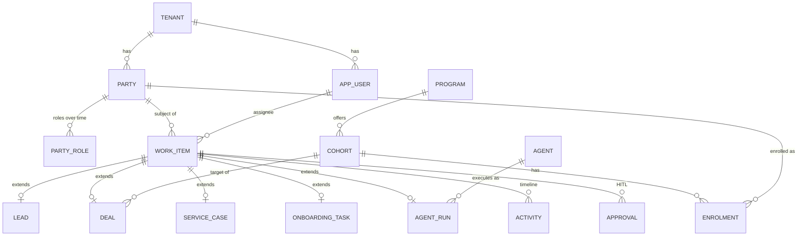

# Digital Edify Agentic CRM — Data Model

**Version:** 2.0 · PostgreSQL + PgVector · ServiceNow-style single data model
**Implements:** `party` (entity SoR) · `work_item` spine + class-table extensions · `relationship` graph · activity/approval/audit · embeddings · optional metadata layer. Multi-tenant with row-level security throughout.

---

## 1. Model map



The spine carries the shared 80% (state, assignee, SLA, audit); extensions carry the type-specific structured fields; `attributes jsonb` carries the variable 20%.

---

## 2. Extensions & tenancy foundation

```sql
CREATE EXTENSION IF NOT EXISTS "pgcrypto";   -- gen_random_uuid()
CREATE EXTENSION IF NOT EXISTS "vector";     -- PgVector

-- Tenants -------------------------------------------------------------
CREATE TABLE tenant (
    id          uuid PRIMARY KEY DEFAULT gen_random_uuid(),
    name        text NOT NULL,
    region      text NOT NULL DEFAULT 'india',
    created_at  timestamptz NOT NULL DEFAULT now()
);

-- Staff users (mapped to Auth0) --------------------------------------
CREATE TABLE app_user (
    id          uuid PRIMARY KEY DEFAULT gen_random_uuid(),
    tenant_id   uuid NOT NULL REFERENCES tenant(id),
    auth0_sub   text NOT NULL UNIQUE,          -- Auth0 'sub' claim
    email       text NOT NULL,
    name        text,
    role        text NOT NULL DEFAULT 'advisor'
                CHECK (role IN ('admin','advisor','service_rep','readonly')),
    active      boolean NOT NULL DEFAULT true,
    created_at  timestamptz NOT NULL DEFAULT now(),
    UNIQUE (tenant_id, email)
);
```

A reusable helper for the tenant GUC set by the API per request:

```sql
CREATE OR REPLACE FUNCTION current_tenant() RETURNS uuid
LANGUAGE sql STABLE AS $$
  SELECT NULLIF(current_setting('app.tenant_id', true), '')::uuid
$$;
```

---

## 3. Party — single source of truth for people/orgs

```sql
CREATE TABLE party (
    id          uuid PRIMARY KEY DEFAULT gen_random_uuid(),
    tenant_id   uuid NOT NULL REFERENCES tenant(id),
    kind        text NOT NULL DEFAULT 'person' CHECK (kind IN ('person','org')),
    name        text NOT NULL,
    identifiers jsonb NOT NULL DEFAULT '{}',   -- {email, phone, whatsapp, ...}
    attributes  jsonb NOT NULL DEFAULT '{}',
    created_at  timestamptz NOT NULL DEFAULT now(),
    updated_at  timestamptz NOT NULL DEFAULT now()
);
CREATE INDEX party_tenant_idx     ON party (tenant_id);
CREATE INDEX party_identifiers_gin ON party USING gin (identifiers);
CREATE INDEX party_name_trgm       ON party USING gin (name gin_trgm_ops); -- needs pg_trgm

-- A party plays roles over time (lead -> learner -> alumnus; staff -> advisor)
CREATE TABLE party_role (
    id          uuid PRIMARY KEY DEFAULT gen_random_uuid(),
    tenant_id   uuid NOT NULL REFERENCES tenant(id),
    party_id    uuid NOT NULL REFERENCES party(id) ON DELETE CASCADE,
    role        text NOT NULL
                CHECK (role IN ('lead','contact','learner','advisor','alumnus')),
    valid_from  date NOT NULL DEFAULT current_date,
    valid_to    date,
    UNIQUE (party_id, role, valid_from)
);
CREATE INDEX party_role_lookup_idx ON party_role (tenant_id, role, party_id);
```

> `pg_trgm` (`CREATE EXTENSION pg_trgm`) enables fuzzy name search; drop that index if not needed early.

---

## 4. The `work_item` spine (ServiceNow `task` analog)

```sql
CREATE TABLE work_item (
    id          uuid PRIMARY KEY DEFAULT gen_random_uuid(),
    tenant_id   uuid NOT NULL REFERENCES tenant(id),
    number      text NOT NULL,                 -- human id e.g. LEAD-9701
    type        text NOT NULL
                CHECK (type IN ('lead','deal','service_case','onboarding_task','agent_run')),
    party_id    uuid REFERENCES party(id),     -- the subject (nullable for agent_run)
    assignee_id uuid REFERENCES app_user(id),  -- owner / advisor
    state       text NOT NULL DEFAULT 'open',
    priority    int  NOT NULL DEFAULT 3,        -- 1 (high) .. 5 (low)
    sla_due     timestamptz,
    attributes  jsonb NOT NULL DEFAULT '{}',    -- flexible 20%
    created_at  timestamptz NOT NULL DEFAULT now(),
    updated_at  timestamptz NOT NULL DEFAULT now(),
    UNIQUE (tenant_id, number)
);

-- Hot-path indexes
CREATE INDEX wi_tenant_type_state_idx ON work_item (tenant_id, type, state);
CREATE INDEX wi_assignee_idx          ON work_item (tenant_id, assignee_id);
CREATE INDEX wi_party_idx             ON work_item (tenant_id, party_id);
CREATE INDEX wi_sla_idx               ON work_item (tenant_id, sla_due) WHERE sla_due IS NOT NULL;
CREATE INDEX wi_attributes_gin        ON work_item USING gin (attributes);
```

### 4.1 Class-table extensions (1:1 with the spine)

```sql
CREATE TABLE lead (
    work_item_id uuid PRIMARY KEY REFERENCES work_item(id) ON DELETE CASCADE,
    source       text,                    -- web, referral, webinar, paid...
    score        int,                     -- 0..100 (set by Lead Scoring agent)
    score_reason text,
    city         text
);

CREATE TABLE deal (
    work_item_id uuid PRIMARY KEY REFERENCES work_item(id) ON DELETE CASCADE,
    cohort_id    uuid REFERENCES cohort(id),
    value        numeric(12,2),           -- INR
    probability  int CHECK (probability BETWEEN 0 AND 100)
);

CREATE TABLE service_case (
    work_item_id uuid PRIMARY KEY REFERENCES work_item(id) ON DELETE CASCADE,
    category     text,                    -- billing, content, technical, scheduling...
    channel      text,                    -- whatsapp, email, call, portal
    csat         int CHECK (csat BETWEEN 1 AND 5)
);

CREATE TABLE onboarding_task (
    work_item_id uuid PRIMARY KEY REFERENCES work_item(id) ON DELETE CASCADE,
    enrolment_id uuid REFERENCES enrolment(id),
    step         text                     -- kyc, welcome_call, lms_access, kickoff...
);

CREATE TABLE agent_run (
    work_item_id uuid PRIMARY KEY REFERENCES work_item(id) ON DELETE CASCADE,
    agent_key    text NOT NULL,           -- lead_scoring, outreach, triage...
    run_id       text NOT NULL,           -- LangGraph/LangSmith run id
    status       text NOT NULL DEFAULT 'running',
    steps        jsonb NOT NULL DEFAULT '[]',
    started_at   timestamptz NOT NULL DEFAULT now(),
    finished_at  timestamptz
);
CREATE INDEX agent_run_key_idx ON agent_run (agent_key, status);
```

### 4.2 Number generation

Per-type human-friendly IDs via sequences:

```sql
CREATE SEQUENCE seq_lead;  CREATE SEQUENCE seq_deal;
CREATE SEQUENCE seq_case;  CREATE SEQUENCE seq_onb;  CREATE SEQUENCE seq_run;
-- App sets number on insert, e.g. 'LEAD-' || nextval('seq_lead')
-- (kept in app code so prefixes/formatting stay flexible)
```

---

## 5. Catalog & enrolment (edtech reference data)

```sql
CREATE TABLE program (
    id          uuid PRIMARY KEY DEFAULT gen_random_uuid(),
    tenant_id   uuid NOT NULL REFERENCES tenant(id),
    name        text NOT NULL,            -- e.g. Full-Stack, Data Engineering
    track       text,
    attributes  jsonb NOT NULL DEFAULT '{}'
);

CREATE TABLE cohort (
    id          uuid PRIMARY KEY DEFAULT gen_random_uuid(),
    tenant_id   uuid NOT NULL REFERENCES tenant(id),
    program_id  uuid NOT NULL REFERENCES program(id),
    name        text NOT NULL,            -- e.g. FS-Jan-2026
    start_date  date,
    seats       int,
    price       numeric(12,2),            -- INR
    status      text NOT NULL DEFAULT 'open'
);
CREATE INDEX cohort_tenant_program_idx ON cohort (tenant_id, program_id);

CREATE TABLE enrolment (
    id          uuid PRIMARY KEY DEFAULT gen_random_uuid(),
    tenant_id   uuid NOT NULL REFERENCES tenant(id),
    party_id    uuid NOT NULL REFERENCES party(id),
    cohort_id   uuid NOT NULL REFERENCES cohort(id),
    deal_id     uuid REFERENCES work_item(id),   -- the deal it converted from
    status      text NOT NULL DEFAULT 'active'
                CHECK (status IN ('active','completed','dropped','deferred')),
    created_at  timestamptz NOT NULL DEFAULT now()
);
CREATE INDEX enrolment_party_idx  ON enrolment (tenant_id, party_id);
CREATE INDEX enrolment_cohort_idx ON enrolment (tenant_id, cohort_id);
```

---

## 6. Relationship graph (CMDB relationships analog)

```sql
CREATE TABLE relationship (
    id          uuid PRIMARY KEY DEFAULT gen_random_uuid(),
    tenant_id   uuid NOT NULL REFERENCES tenant(id),
    from_type   text NOT NULL,            -- 'work_item','party','enrolment'...
    from_id     uuid NOT NULL,
    rel_type    text NOT NULL,            -- enrolled_in, referred_by, case_about...
    to_type     text NOT NULL,
    to_id       uuid NOT NULL,
    attributes  jsonb NOT NULL DEFAULT '{}',
    created_at  timestamptz NOT NULL DEFAULT now()
);
-- Traverse both directions efficiently
CREATE INDEX rel_from_idx ON relationship (tenant_id, from_type, from_id);
CREATE INDEX rel_to_idx   ON relationship (tenant_id, to_type, to_id);
CREATE UNIQUE INDEX rel_unique_idx
    ON relationship (tenant_id, from_type, from_id, rel_type, to_type, to_id);
```

> Cross-type edges can't use native FKs — validity is enforced in the app layer. This is the deliberate tradeoff that buys a uniform 360° graph.

---

## 7. Activity timeline (high-volume, partitioned)

```sql
CREATE TABLE activity (
    id           uuid NOT NULL DEFAULT gen_random_uuid(),
    tenant_id    uuid NOT NULL,
    work_item_id uuid,                    -- nullable (party-level events)
    party_id     uuid,
    actor_type   text NOT NULL,           -- user | agent | system | channel
    actor_id     text,
    channel      text,                    -- whatsapp, email, call, vimeo, portal
    verb         text NOT NULL,           -- created, messaged, called, scored...
    payload      jsonb NOT NULL DEFAULT '{}',
    ts           timestamptz NOT NULL DEFAULT now(),
    PRIMARY KEY (id, ts)
) PARTITION BY RANGE (ts);

-- Monthly partitions (create ahead via a scheduled job); example:
CREATE TABLE activity_2026_06 PARTITION OF activity
    FOR VALUES FROM ('2026-06-01') TO ('2026-07-01');

CREATE INDEX activity_wi_idx    ON activity (tenant_id, work_item_id, ts DESC);
CREATE INDEX activity_party_idx ON activity (tenant_id, party_id, ts DESC);
CREATE INDEX activity_gin       ON activity USING gin (payload);
```

Old partitions are detached and archived to Blob — this is the release valve that keeps Postgres comfortable without a second datastore.

---

## 8. Approvals (HITL gate)

```sql
CREATE TABLE approval (
    id            uuid PRIMARY KEY DEFAULT gen_random_uuid(),
    tenant_id     uuid NOT NULL REFERENCES tenant(id),
    work_item_id  uuid REFERENCES work_item(id),   -- usually the agent_run
    action_type   text NOT NULL,         -- send_whatsapp, place_call, book_meeting...
    mode          text NOT NULL DEFAULT 'supervised'
                  CHECK (mode IN ('auto','supervised','manual')),
    status        text NOT NULL DEFAULT 'pending'
                  CHECK (status IN ('pending','approved','rejected','expired')),
    proposed      jsonb NOT NULL,        -- the drafted action payload
    requested_by  text,                  -- agent_key
    decided_by    uuid REFERENCES app_user(id),
    decided_at    timestamptz,
    created_at    timestamptz NOT NULL DEFAULT now()
);
CREATE INDEX approval_queue_idx ON approval (tenant_id, status, created_at);

-- Per-tenant policy: which action types auto-run vs require a human
CREATE TABLE approval_policy (
    tenant_id   uuid NOT NULL REFERENCES tenant(id),
    action_type text NOT NULL,
    mode        text NOT NULL CHECK (mode IN ('auto','supervised','manual')),
    PRIMARY KEY (tenant_id, action_type)
);
```

---

## 9. Audit log (immutable)

```sql
CREATE TABLE audit_log (
    id           bigint GENERATED ALWAYS AS IDENTITY PRIMARY KEY,
    tenant_id    uuid NOT NULL,
    actor_type   text NOT NULL,          -- user | agent | system
    actor_id     text,
    action       text NOT NULL,
    target_type  text,
    target_id    uuid,
    model        text,                   -- LLM used, if any
    context      jsonb NOT NULL DEFAULT '{}',
    ts           timestamptz NOT NULL DEFAULT now()
);
CREATE INDEX audit_tenant_ts_idx ON audit_log (tenant_id, ts DESC);
-- No UPDATE/DELETE granted to the app role; insert-only (enforced via GRANTs + RLS).
```

---

## 10. Embeddings (PgVector, semantic memory / RAG)

```sql
CREATE TABLE embedding (
    id           uuid PRIMARY KEY DEFAULT gen_random_uuid(),
    tenant_id    uuid NOT NULL REFERENCES tenant(id),
    object_type  text NOT NULL,          -- kb_article, transcript, work_item, party_note
    object_id    uuid,
    chunk        text NOT NULL,
    embedding    vector(1536) NOT NULL,  -- match your embedding model dims
    metadata     jsonb NOT NULL DEFAULT '{}',
    created_at   timestamptz NOT NULL DEFAULT now()
);
-- Filter by tenant/type, then ANN search. HNSW for recall+speed.
CREATE INDEX embedding_ann_idx ON embedding
    USING hnsw (embedding vector_cosine_ops);
CREATE INDEX embedding_scope_idx ON embedding (tenant_id, object_type);
```

> Set `vector(N)` to your model's dimensions. Use `ivfflat` instead of `hnsw` if on a Postgres/pgvector version without HNSW; HNSW preferred where available.

---

## 11. Attachments (Blob metadata)

```sql
CREATE TABLE attachment (
    id           uuid PRIMARY KEY DEFAULT gen_random_uuid(),
    tenant_id    uuid NOT NULL REFERENCES tenant(id),
    work_item_id uuid REFERENCES work_item(id),
    party_id     uuid REFERENCES party(id),
    kind         text,                   -- recording, deck, document
    blob_url     text NOT NULL,          -- Azure Blob path (private)
    content_type text,
    size_bytes   bigint,
    created_at   timestamptz NOT NULL DEFAULT now()
);
CREATE INDEX attachment_wi_idx ON attachment (tenant_id, work_item_id);
```

---

## 12. Agent catalog

```sql
CREATE TABLE agent (
    id          uuid PRIMARY KEY DEFAULT gen_random_uuid(),
    tenant_id   uuid NOT NULL REFERENCES tenant(id),
    key         text NOT NULL,           -- lead_scoring, outreach, scheduler...
    name        text NOT NULL,
    domain      text NOT NULL CHECK (domain IN ('sales','service')),
    operates_on text NOT NULL,           -- work_item type it acts on
    enabled     boolean NOT NULL DEFAULT true,
    config      jsonb NOT NULL DEFAULT '{}', -- model, autonomy defaults, prompts ref
    UNIQUE (tenant_id, key)
);
```

---

## 13. Metadata layer (Dictionary analog) — Phase-later / optional

> **Do not build on day one.** Ship Phase 1 with hard-coded `lead`/`deal` types. Introduce these tables only when adding the **third** record type, so new modules become configuration instead of migrations.

```sql
CREATE TABLE record_type (
    key             text PRIMARY KEY,    -- 'placement', 'finance_request'...
    label           text NOT NULL,
    extension_table text,
    enabled         boolean NOT NULL DEFAULT true
);

CREATE TABLE field_def (
    id              uuid PRIMARY KEY DEFAULT gen_random_uuid(),
    record_type_key text NOT NULL REFERENCES record_type(key),
    field           text NOT NULL,
    datatype        text NOT NULL,       -- text, int, numeric, date, ref, enum
    required        boolean NOT NULL DEFAULT false,
    ui              jsonb NOT NULL DEFAULT '{}',
    UNIQUE (record_type_key, field)
);

CREATE TABLE state_model (
    id              uuid PRIMARY KEY DEFAULT gen_random_uuid(),
    record_type_key text NOT NULL REFERENCES record_type(key),
    state           text NOT NULL,
    transitions     jsonb NOT NULL DEFAULT '[]',  -- allowed next states
    sla_policy      jsonb NOT NULL DEFAULT '{}',
    UNIQUE (record_type_key, state)
);
```

---

## 14. Row-Level Security (multi-tenant isolation)

Enable on every tenant-scoped table; policy keys off the GUC the API sets per request (`SET app.tenant_id = '<uuid>'`).

```sql
-- Pattern, repeat for each tenant-scoped table:
ALTER TABLE work_item ENABLE ROW LEVEL SECURITY;
CREATE POLICY work_item_tenant_isolation ON work_item
    USING (tenant_id = current_tenant())
    WITH CHECK (tenant_id = current_tenant());

ALTER TABLE party        ENABLE ROW LEVEL SECURITY;
CREATE POLICY party_tenant ON party
    USING (tenant_id = current_tenant()) WITH CHECK (tenant_id = current_tenant());

-- ... apply the same to: party_role, lead*, deal*, service_case*, onboarding_task*,
-- agent_run*, program, cohort, enrolment, relationship, activity, approval,
-- approval_policy, audit_log, embedding, attachment, agent.
-- (*extension tables can inherit isolation via their FK to work_item, or carry
--  tenant_id directly for direct-query safety — carrying tenant_id is recommended.)
```

> Recommendation: add `tenant_id` to the extension tables too (denormalized) so RLS applies even on direct extension-table queries, not only through the join.

---

## 15. Design rules baked into this schema

1. **Structured 80% as real columns, flexible 20% as JSONB** — hot fields (`score`, `state`, `value`, `probability`) are typed and indexed; `attributes`/`payload` hold the variable rest. Avoids full EAV slowness.
2. **Class-table inheritance, not a mega-table** — `work_item` + small 1:1 extensions keep queries clean and per-type indexable.
3. **Partition the firehose** — `activity` (and optionally `agent_run` steps) partitioned monthly; archive cold partitions to Blob.
4. **Index the generic graph** — `relationship` has both-direction composite indexes; app-layer validates edge types.
5. **Tenant everywhere + RLS** — isolation enforced in the database, not just the app.
6. **Earn the metadata layer** — config-driven types only when the third record type arrives.

---

*This schema is the concrete form of the single data model: one `party` truth for people, one `work_item` spine for everything actionable, one `relationship` graph for the 360° view — multi-tenant, partition-ready, vector-enabled, and extensible to future domains (Placement, Finance, Alumni) as new types on the same spine without re-platforming.*
