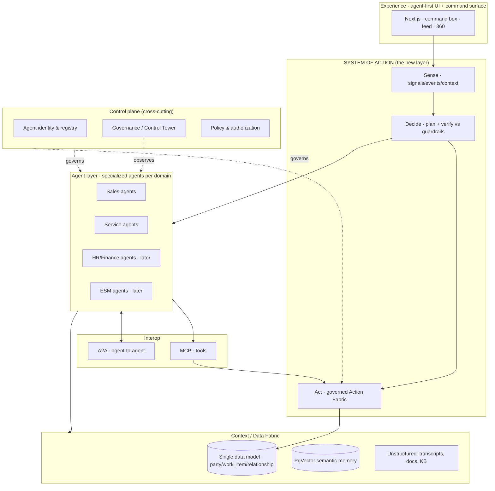

# Digital Edify — Futuristic Agentic Platform: Recommendations

**Version:** 1.0 (forward-looking) · Extends 01 Application / 02 Infrastructure / 03 Data Model
**Vision:** start as a Customer System of Record (Marketing, Sales, Service) → extend to Employee SoR (HR, Finance) → Enterprise Service Management → all unified by an **Agentic System of Action**.
**Grounding:** synthesized from 2026 enterprise-AI research (ServiceNow, Salesforce, Microsoft, Linux Foundation AAIF, CSA, Gartner/Forrester signals).

---

## 1. The good news: your core bet matches where the market is going

The entire enterprise-AI industry in 2026 is making one move: **from systems of record to systems of action.** ServiceNow (Action Fabric, "graph of graphs"), Salesforce (Agentforce, "CRM as execution layer"), Workday ("agent system of record"), and Microsoft (Agent 365) are all converging on the same architecture you've described:

> One unified data platform underneath every domain, with a governed agent layer that *acts* across all of it.

Your existing design already nails the hardest part — the **single data model** (`party` + `work_item` spine + `relationship` graph). That is precisely the "one platform underneath all work" pattern these vendors spent years building. Customer (lead/deal/case) today, Employee (HR case, finance request) and ESM (incident, change) tomorrow are just **new `work_item` types and new `party` roles on the same spine.** You don't re-platform — you extend.

What this document adds: the **five platform primitives** that turn that data model into a true *system of action*, built once and reused across every domain.

---

## 2. The target architecture (layered)

Read top-to-bottom: experience → **Sense/Decide/Act** → specialized agents → context. The **control plane** governs identity, policy, and observability across everything; **MCP/A2A** are the interop seams.

---

## 3. The five platform primitives (build once, reuse everywhere)

### 3.1 A System-of-Action layer with **planning separated from action**

The single most important architectural lesson from 2026 deployments: **do not fuse planning and execution into one opaque agent loop.** Leading platforms split it into three explicit stages:

- **Sense** — ingest signals (channel events, watch %, attendance, ticket inflow) and assemble context.
- **Decide** — plan the action *and verify it against guardrails/policy* before anything executes.
- **Act** — execute via a **governed Action Fabric**: a catalog of typed, permissioned, auditable actions (send WhatsApp, issue refund, create enrolment, approve leave, reset access).

For you, this means **promoting your current tool functions + approval gate into a first-class "Action Fabric"** — a registry of named actions with per-action policy (auto / supervised / manual), required scopes, and an audit contract. The payoff: when you add HR or Finance, those domains *reuse the same action engine, approval gate, and audit* — they just register new actions. This is the reuse that makes expansion cheap.

### 3.2 An **agent identity & control plane** (the biggest addition)

In 2026 the consensus is blunt: **an AI agent is a new identity class** — a "digital principal," not a bot or service account — and **identity is the control plane** of the agentic enterprise. Treat every agent as a governed non-human identity:

| Principle | Concrete implementation |
|---|---|
| **Distinct identity per agent** | Each agent gets its own credential (Auth0 M2M / managed identity), never a shared super-user. |
| **Authority delegated from a human** | Agents act *on behalf of* the initiating user; authority is bound and traceable to an accountable person. |
| **Least privilege + just-in-time** | Scopes granted per task; short-lived tokens; no standing broad access. |
| **Agent registry** | Every agent registered with owner, purpose, risk level, TTL, allowed actions, allowed data scopes. No orphaned credentials. |
| **Runtime authorization** | Action requests checked at execution (purpose, task, risk, delegation) — policy-as-code (OPA/ABAC style), not just role checks. |
| **Agent-aware logging** | Logs must distinguish agent actions from human actions and record *what the agent did*, not just what it could reach. |

This is mostly an **extension of tables and policy you already have** — your `agent` catalog becomes a governed registry; your `audit_log` already exists; you add scoped credentials and a runtime authorization check in front of the Action Fabric. Doing it now is cheap; retrofitting it across HR/Finance/ESM later is expensive and risky (shadow agents, over-privileged access).

### 3.3 Interoperability: **adopt the standard stack, don't build glue**

The protocol layer has standardized; custom integration layers are now considered the costly mistake.

- **MCP (Model Context Protocol)** — the standard for **agent ↔ tools/data**. Adopt it as your tool interface (your "plain typed functions" become MCP tools) and front it with an **MCP gateway** so every action gets action-level inspection, auth, and logging. Use **Streamable HTTP transport + OAuth 2.1**.
- **A2A (Agent-to-Agent)** — the standard for **agent ↔ agent** coordination across domains/vendors. You won't need it for v1 (single domain), but as you add HR/Finance/ESM, a Sales agent handing off to a Finance agent should use A2A with **Agent Card** discovery rather than bespoke calls.
- **Sequence:** MCP first (you have tools now), A2A when you have ≥2 agent domains that must collaborate. Don't implement both on day one — but design the tool/agent seams so adding them is configuration, not rework.

### 3.4 A **context / data fabric** — and treat data hygiene as the gate

Research is unanimous that **data readiness is the #1 thing that makes or breaks agents** ("if the data is messy, agents will be ineffective or worse, dangerous"). Your single data model is the structured core; the agentic future also needs unstructured context unified with it:

- **Structured SoR** — `party` / `work_item` / `relationship` (already designed).
- **Semantic layer** — PgVector embeddings over transcripts, KB, notes (already designed).
- **The fabric = the join** — the `relationship` graph + embeddings *is* your "graph of graphs" in miniature: agents retrieve connected structured facts **and** semantic context in one place, scoped by tenant/domain.
- **Gate:** before turning an agent loose on a new domain, ensure that domain's data is clean, deduplicated (one `party`!), and access-scoped. Make data hygiene an explicit phase-gate, not an afterthought.

### 3.5 A **governance Control Tower** (observability + policy + cost)

Extend LangSmith + `audit_log` into a single pane that, across *all* domains and agents, shows: every run and its steps, policy compliance, approvals, **cost per agent run**, and anomalies. This is what lets you safely scale autonomy: you loosen an action from "supervised" to "auto" only when the Control Tower's eval data justifies it. Per-tenant cost ceilings and prompt-injection screening live here too.

---

## 4. Expansion roadmap (platform-first, domain-by-domain)

Each new domain is **new types + new actions on the same primitives** — never a new stack.

| Phase | Domain | New `work_item` types / `party` roles | Reuses (unchanged) |
|---|---|---|---|
| **1** | Customer SoR — Sales + Service | lead, deal, service_case, onboarding_task | — (establishes the primitives) |
| **2** | Customer SoR — Marketing | campaign, segment, journey | spine, action fabric, identity, control tower |
| **3** | Employee SoR — HR | hr_case, leave_request, onboarding (employee) + role `employee` | everything from P1–2 |
| **4** | Employee SoR — Finance | finance_request, invoice_approval, reimbursement | everything; adds finance-specific actions + stricter policy |
| **5** | Enterprise Service Mgmt | incident, change, problem, service_request | everything; ESM is "just another `task` domain" |
| **6** | Cross-domain orchestration | A2A handoffs (Sales→Finance, HR→ESM) | adds A2A + agent collaboration patterns |

The strategic point: by Phase 3 you stop building infrastructure and start **configuring domains**. That is the ServiceNow/Salesforce economics — and it's available to you because you chose the single data model early.

---

## 5. Design principles & cautions

1. **Separate Sense / Decide / Act.** Never one opaque loop. Plan-and-verify before execute.
2. **Bounded autonomy + human-in-the-loop stays.** 2026 reality: hallucinations and prompt-injection mean consequential actions keep a human gate. Default new actions to *supervised*; earn *auto* with eval data.
3. **Identity-first for agents.** Distinct identity, least privilege, delegated authority, full attribution — from day one.
4. **Specialize agents; give them job descriptions.** Narrow, focused agents (Gartner: ~70% of multi-agent systems will be narrow-role by 2027) beat one general agent. Define each agent's purpose, scope, and allowed actions explicitly.
5. **Adopt standards, avoid custom glue.** MCP for tools, A2A for agent coordination, OAuth 2.1, Agent Cards.
6. **Earn each abstraction.** Don't build the metadata layer, A2A, or a full control tower before you have the second/third domain that needs them. Build the *seams* now; build the *layers* when the second domain arrives. (Consistent with the v1.2 data-model guidance.)
7. **Data hygiene is a phase-gate.** No agent on a domain whose data isn't clean and scoped.
8. **Watch for agent sprawl / shadow AI.** A sanctioned, self-service path to register governed agents prevents ungoverned ones.

---

## 6. Concrete deltas to the existing architecture (01/02/03)

What to add to what you already have:

- **Data model (doc 03):** evolve the `agent` table into an **agent registry** (owner, purpose, risk, ttl, allowed_actions, data_scopes, credential_ref). Add **`action_definition`** and **`action_policy`** tables (the Action Fabric catalog — generalizes today's tools + `approval_policy`). Add an **`agent_credential`** linkage to Auth0 M2M / managed identity.
- **Application (doc 01):** refactor the agent module into explicit **Sense / Decide / Act** stages; put a **runtime authorization check** in front of the Act stage; expose tools via an **MCP server + gateway**; reserve an **A2A endpoint + Agent Card** for Phase 6.
- **Infrastructure (doc 02):** add an **agent identity/credential store** (Key Vault + Auth0 M2M), an **MCP gateway** as a governed egress for actions, and **Control Tower** dashboards aggregating `agent_run` + `audit_log` + cost from LangSmith/Azure Monitor.
- **Governance:** adopt **policy-as-code** for action authorization and an **agent-aware audit** standard (agent vs human attribution).

None of these change the "one frontend, one backend, one database" shape. They harden it into a governed, extensible **system of action**.

---

*Bottom line: you've already made the expensive correct decision (single data model). The forward work is not more infrastructure — it's five reusable primitives (Action Fabric, agent identity/control plane, MCP/A2A interop, context fabric, governance Control Tower) that let you extend from Customer → Employee → ESM as configuration. That is exactly the architecture the market leaders are converging on in 2026 — and you can build it leaner because you're starting clean.*
