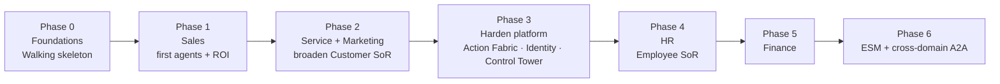

# Digital Edify — Enterprise Agentic AI Platform: Build Plan

**Version:** 1.0 · Companion to 01 Application / 02 Infrastructure / 03 Data Model / 04 Recommendations
**Approach:** platform-first, value-early. Build the reusable primitives once via a thin end-to-end slice, prove ROI on Sales fast, then extend to new domains as configuration.

> **Assumptions (calibrate to your reality):** durations below assume a focused core team of ~5–7 (see §3) building in-house. They're *relative sequence + indicative effort*, not fixed dates — tell me your team size and target go-live and I'll re-time it.

---

## 1. The shape of the plan



Two ideas govern the whole program:

1. **Walking skeleton first.** Before breadth, get *one* thin slice working end-to-end (UI → agent → approval → action → write-back → audit). It de-risks the architecture and gives everything else a template.
2. **Build seams now, layers later.** In early phases you build the *interfaces* (tools, agent registry stub, action contract). You build the heavy *layers* (full Action Fabric, A2A, Control Tower) only when a second domain makes them pay off. Earn each abstraction.

---

## 2. Execution principles (non-negotiables)

- **Thin vertical slices**, not horizontal layers — every increment is demoable end-to-end.
- **Eval-gated from day one** — no agent ships without passing LangSmith evals in CI.
- **Bounded autonomy** — every consequential action defaults to *supervised*; graduate to *auto* only on eval evidence.
- **Identity-first agents** — even the first agent runs under its own scoped identity, never a super-user.
- **Data hygiene is a phase-gate** — no agent turned loose on a domain whose data isn't clean, deduplicated, and access-scoped.
- **One model, one engine** — every new record type extends the `work_item` spine; no domain silos.

---

## 3. The team

A small senior team beats a large one here (the 2026 barrier data flags *skills* and *data readiness*, not headcount). Indicative core:

| Role | Focus | Notes |
|---|---|---|
| Tech lead / architect | Owns the platform shape, gates | 1 |
| Backend / AI engineers | FastAPI, LangGraph agents, Action Fabric | 2 |
| Frontend engineer | Next.js experience, command box, feed | 1 |
| Data engineer | Schema, data hygiene, RAG/embeddings, migrations | 1 (critical — data is the #1 risk) |
| DevOps / platform | Azure, CI/CD, identity, observability | 1 (can be shared early) |
| Product / domain owner | Prioritization, approval policies, eval design | 1 |

Add a security/governance owner by Phase 3 (when agent identity + Control Tower harden), and domain SMEs (HR, Finance) as those phases begin.

---

## 4. Workstreams (run in parallel across phases)

| Workstream | Owns |
|---|---|
| **Platform & Data** | Single data model, migrations, RLS, data hygiene, context/RAG |
| **Agent & AI** | LangGraph graphs, LLM gateway, evals, prompt/graph versioning |
| **Experience** | Next.js UI, command box, feed, approvals, 360° view |
| **Integrations** | WhatsApp, Exotel, Zoom, Vimeo, channel webhooks |
| **Governance & Security** | Agent identity, approval policy, audit, Control Tower |
| **DevOps & Infra** | Azure, CI/CD with eval gate, environments, observability, cost |

---

## 5. Phased plan

### Phase 0 — Foundations & walking skeleton  · *indicative ~3–4 wks*
**Goal:** a working (non-agentic) CRM slice + the agent loop proven once.
**Build:**
- Azure + Vercel + Auth0 + GitHub Actions baseline (one environment, then preview/staging/prod).
- Postgres single data model core: `tenant`, `app_user`, `party`, `party_role`, `work_item` + `lead`/`deal`, `relationship`, `activity`, `audit_log`, RLS. (From doc 03.)
- FastAPI backend skeleton + Next.js shell (command box, feed, leads list) + BFF auth.
- **Walking skeleton:** one trivial agent run (e.g., "summarize this lead") going UI → FastAPI → LangGraph → approval gate → write `activity` + `audit_log` → feed update, traced in LangSmith.
**Exit gate:** a human can log in, see leads, fire one agent action through the approval gate, and see it audited and traced.

### Phase 1 — Customer SoR: Sales  · *indicative ~6–8 wks*
**Goal:** real ROI on the sales motion; the agent pattern templated.
**Build (in order):**
1. **Lead Scoring agent** (read-only) — `plan → retrieve_context (RAG) → score → write_back`. Gemini/small model for volume. Proves scoring quality via evals. *Lowest risk, immediate value.*
2. **Outreach agent** (writes, supervised) — drafts WhatsApp/email follow-ups → approval gate → send tool → write-back. First *consequential* action; exercises HITL properly.
3. **Scheduler agent** — books advisor demos via Zoom; confirmations via WhatsApp.
4. Pipeline kanban + record 360° view; `deal`, `program`, `cohort`, `enrolment` tables.
**Primitives advanced:** tool functions (typed), approval policy table, agent runs as `work_item`.
**Exit gate:** advisors run their day through the product; scoring + outreach measurably save time; evals green in CI.

### Phase 2 — Customer SoR: Service + Marketing  · *indicative ~6–8 wks*
**Goal:** complete the Customer system of record; broaden agent catalog.
**Build:** `service_case` + Triage agent (RAG over policies + history), Onboarding agent (`onboarding_task`), Retention signals (Vimeo watch %, attendance); Marketing types (`campaign`, `segment`); inbound channel webhooks normalized to `activity`.
**Primitives advanced:** the tool count now justifies formalizing the **Action Fabric** (action registry + per-action policy) and standing up an **MCP server + gateway** for governed tool access.
**Exit gate:** inbound service handled agent-first with HITL; one data model spans Marketing+Sales+Service; Action Fabric is the single execution path.

### Phase 3 — Harden the platform primitives  · *indicative ~4–6 wks*
**Goal:** make the platform safe and cheap to extend *before* adding employee domains.
**Build:**
- **Agent identity & control plane** — per-agent scoped credentials (Auth0 M2M / managed identity), the **agent registry** (owner, purpose, risk, TTL, allowed actions/data scopes), runtime authorization in front of the Act stage, agent-vs-human audit attribution.
- **Governance Control Tower** — cross-agent dashboards (runs, approvals, policy compliance, cost per run, anomalies) over `agent_run` + `audit_log` + LangSmith.
- **Sense/Decide/Act refactor** — formalize the three stages so planning is verified against guardrails before execution.
**Exit gate:** every agent has a distinct governed identity; one pane shows all agent activity + cost; autonomy can be graduated with evidence. **This gate is what licenses multi-domain expansion.**

### Phase 4 — Employee SoR: HR  · *indicative ~4–6 wks*
**Goal:** prove the "new domain = configuration" thesis.
**Build:** `party_role = employee`; new `work_item` types `hr_case`, `leave_request`; HR-specific actions registered in the existing Action Fabric; an HR Triage/Helpdesk agent reusing the same runtime, approval gate, identity, and audit.
**Data gate:** employee data clean + scoped before agents run.
**Exit gate:** HR runs on the same platform with *no new infrastructure* — only new types, actions, and an agent.

### Phase 5 — Employee SoR: Finance  · *indicative ~4–6 wks*
**Goal:** add a higher-stakes domain with stricter policy.
**Build:** `finance_request`, `invoice_approval`, `reimbursement`; finance actions with **stricter approval modes** (more manual gates); tighter least-privilege scopes. Demonstrates policy flexibility per domain on shared primitives.
**Exit gate:** finance workflows governed with domain-appropriate autonomy; audit satisfies finance controls.

### Phase 6 — ESM + cross-domain orchestration  · *indicative ~6–8 wks*
**Goal:** enterprise service management + agents that collaborate across domains.
**Build:** ESM types (`incident`, `change`, `problem`, `service_request`); **A2A endpoints + Agent Cards** so a Sales agent can hand off to Finance, HR to ESM, etc.; the optional **metadata layer** (`record_type`/`field_def`/`state_model`) now earns its place as you template new types fast.
**Exit gate:** a request flows across domains via governed agent-to-agent handoffs; new record types are configured, not coded.

---

## 6. The first 90 days (most actionable detail)

| Milestone | What "done" looks like |
|---|---|
| **M1 — Skeleton up** | Infra + auth + data model core deployed; one agent action audited end-to-end. |
| **M2 — Lead Scoring live** | Leads auto-scored with reasons; eval suite green; advisors see scores in the feed. |
| **M3 — Outreach (supervised)** | Drafted follow-ups approved by a human and sent via WhatsApp; full audit trail. |
| **M4 — Scheduler + pipeline** | Demos booked by agent; kanban + 360° record live; first ROI readout. |

Everything after M4 follows the phase plan. M1–M4 *is* the proof that the architecture works and the team can ship it.

---

## 7. How autonomy graduates (the trust ladder)

Each action type moves only when data earns it:

```
manual  →  supervised (human approves each)  →  auto-within-bounds  →  auto
            ▲ start here for consequential actions
```

Promotion criteria, visible in the Control Tower: approval-acceptance rate high, eval scores stable, zero policy breaches over a defined window, cost within ceiling. Demote instantly on regression.

---

## 8. Risks & mitigations

| Risk | Mitigation (built into the plan) |
|---|---|
| **Messy/duplicated data** (#1 industry failure cause) | Data-hygiene phase-gate per domain; single `party` SoR; dedup before agents run. |
| **Over-privileged / shadow agents** | Identity-first from Phase 0; agent registry + least privilege by Phase 3; sanctioned self-service registration. |
| **Agent errors / prompt injection** | Bounded autonomy + HITL; gateway PII redaction + injection screening; Sense/Decide/Act separation. |
| **Cost runaway** | Cost-per-run tracked from day one; per-tenant ceilings; cheap models for high-volume tasks. |
| **Over-engineering early** | "Build seams now, layers later"; defer Action Fabric/identity/A2A/metadata to the phase that needs them. |
| **Scope creep across domains** | Hard exit gates; Phase 3 hardening *required* before employee domains. |
| **Skills gap** | Small senior team; data engineer treated as critical; security owner added at Phase 3. |

---

## 9. Success metrics by horizon

- **Phase 1 (Sales):** advisor time saved per lead; outreach approval-acceptance rate; lead-to-demo conversion lift.
- **Phase 2 (Service):** first-response time; % cases handled agent-first; CSAT.
- **Phase 3 (Platform):** every agent governed-identity coverage 100%; cost per run visible; mean time to add an action.
- **Phase 4–6 (Expansion):** **time-to-stand-up-a-new-domain** (the platform KPI — it should *fall* each phase); cross-domain handoff success rate.

The defining metric of success is that **each new domain takes less effort than the last.** That falling curve is the proof the platform thesis worked.

---

*Net: Phase 0 proves the loop, Phase 1 proves the ROI, Phases 2–3 build and harden the reusable platform, Phases 4–6 expand into Employee SoR and ESM as configuration. Value in weeks, a governed platform within the first cycle, and an expansion curve that gets cheaper over time.*
