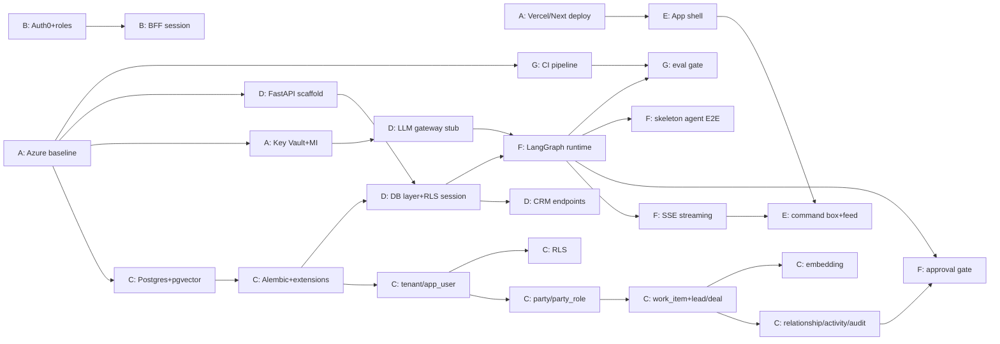

# Digital Edify — Phase 0 Sprint Backlog

**Version:** 1.0 · Foundations & Walking Skeleton · Companion to 05 Build Plan
**Sprint goal:** *A user can log in, see leads, trigger one agent action through the approval gate, and see it audited and traced in LangSmith.*
**Definition of "sprint done" (exit gate):** the walking skeleton runs end-to-end in a deployed environment, with CI (including a proven eval gate) green.

> Estimates are story points (Fibonacci). IDs are `DE-###`. Owners map to the workstreams in doc 05.

---

## 1. Epics

| Epic | Theme | Workstream |
|---|---|---|
| **A** | Environment & DevOps foundation | DevOps & Infra |
| **B** | Identity & Auth | DevOps / Backend |
| **C** | Data model core | Platform & Data |
| **D** | Backend skeleton | Agent & AI / Backend |
| **E** | Frontend shell | Experience |
| **F** | Agent loop (walking skeleton) | Agent & AI |
| **G** | CI/CD + eval gate | DevOps & Infra |

---

## 2. Dependency overview

**Critical path to the skeleton:** DE-001 → DE-002 → DE-020 → DE-021/022/023/024 → DE-031 → DE-050 → DE-052 → DE-053 (with DE-040/042 + DE-051 for the UI surface).

---

## 3. Tickets

### Epic A — Environment & DevOps

**DE-001 · Provision Azure baseline** · 5 · *deps: none*
Resource group, VNet (public ingress + private data subnet), Container Apps environment, Azure Container Registry, App Gateway+WAF placeholder.
*DoD:* IaC (Bicep/Terraform) applies cleanly; a hello container runs on Container Apps; private subnet exists; ACR push/pull works.

**DE-002 · Provision PostgreSQL Flexible Server + pgvector** · 3 · *deps: DE-001*
Managed Postgres in India region on the private subnet; enable `vector`.
*DoD:* DB reachable from Container Apps via private endpoint only (not public); `CREATE EXTENSION vector;` succeeds; connection string in Key Vault.

**DE-003 · Key Vault + managed identity wiring** · 3 · *deps: DE-001*
Key Vault; backend app assigned a managed identity with get-secret rights.
*DoD:* backend reads a test secret via managed identity; no secrets in env files or image.

**DE-004 · Vercel project + Next.js deploy pipeline** · 2 · *deps: none*
*DoD:* push to `main` deploys to Vercel; every PR gets a preview URL.

### Epic B — Identity & Auth

**DE-010 · Auth0 tenant, app, RBAC roles** · 3 · *deps: none*
Roles: `admin`, `advisor`, `service_rep`, `readonly`. Seed test users per role.
*DoD:* login works; issued JWT carries `sub`, tenant claim, and role; test users documented.

**DE-011 · Next.js BFF session + JWT validation + tenant context** · 3 · *deps: DE-004, DE-010*
*DoD:* authenticated route returns user + tenant; unauthenticated requests blocked; session refresh works.

**DE-012 · FastAPI JWT verification + set `app.tenant_id` GUC** · 3 · *deps: DE-010, DE-031*
*DoD:* every API request validates the JWT and sets the Postgres tenant GUC for the session; a test proves RLS isolation is active.

### Epic C — Data model core

**DE-020 · Alembic tooling + base extensions** · 2 · *deps: DE-002*
*DoD:* `alembic upgrade head` enables `pgcrypto` + `vector`; CI runs migrations against a throwaway DB.

**DE-021 · Tables: `tenant`, `app_user`** · 2 · *deps: DE-020*
*DoD:* tables + FKs created; one tenant and one user per role seeded via migration/seed script.

**DE-022 · Tables: `party`, `party_role`** · 3 · *deps: DE-021*
*DoD:* tables + indexes (incl. GIN on identifiers); repository function creates a person with identifiers.

**DE-023 · `work_item` spine + `lead`/`deal` extensions + number generation** · 5 · *deps: DE-022*
*DoD:* inserting a lead creates a `work_item` (type=lead) + `lead` row and returns a human number `LEAD-####`; hot-path indexes present; 50 sample leads seeded.

**DE-024 · `relationship`, `activity` (partitioned), `audit_log`** · 5 · *deps: DE-023*
*DoD:* current-month `activity` partition exists (+ a job/notes to create future ones); inserting an activity and an audit row works and is queryable by work_item.

**DE-025 · Row-Level Security policies + tenant helper** · 3 · *deps: DE-021–024*
*DoD:* RLS enabled on all tenant tables; `current_tenant()` helper present; a test querying as tenant B returns **0** of tenant A's rows.

**DE-026 · `embedding` table + ANN index** · 2 · *deps: DE-023*
*DoD:* table created with `vector(N)` matching the chosen embedding model; HNSW (or ivfflat) index built; insert + nearest-neighbour query verified. (Needed for RAG in Phase 1.)

### Epic D — Backend skeleton

**DE-030 · FastAPI scaffold + health/readiness + config** · 2 · *deps: DE-001*
*DoD:* `/healthz` and `/readyz` green; app deploys to Container Apps; structured logging on.

**DE-031 · Async DB layer + RLS-aware session + repository pattern** · 5 · *deps: DE-020, DE-030*
*DoD:* each request opens a session that sets `app.tenant_id`; repository base supports CRUD; integration test passes against real Postgres.

**DE-032 · CRM endpoints: list leads, get lead 360°** · 3 · *deps: DE-031, DE-023*
*DoD:* `GET /leads` returns seeded leads scoped by tenant; `GET /leads/{id}` returns lead + party + recent activity; OpenAPI published; typed client generated for FE.

**DE-033 · LLM gateway stub** · 5 · *deps: DE-003, DE-030*
Provider router (Claude/Gemini/OpenAI), JSON-schema validation of outputs, PII-redaction hook, cost logging.
*DoD:* a test call routes to a configured model, validates a JSON response against a schema, logs token/cost; keys pulled from Key Vault.

### Epic E — Frontend shell

**DE-040 · Next.js app shell + design tokens from prototype** · 3 · *deps: DE-004*
Layout, icon rail, sidebar; tokenize fonts/gradient from the prototype.
*DoD:* shell matches the prototype's visual language; responsive; passes basic a11y checks.

**DE-041 · Leads list + record view (RSC reads)** · 3 · *deps: DE-040, DE-032, DE-011*
*DoD:* leads list renders from the API scoped to tenant; record page renders the 360° stub (party + timeline).

**DE-042 · Command box + activity feed (client) with SSE** · 5 · *deps: DE-040, DE-051*
*DoD:* typing a command posts to the API and opens an SSE stream; feed renders streamed `step`/`needs_approval`/`result` events; approve button calls the approval endpoint.

### Epic F — Agent loop (walking skeleton)

**DE-050 · LangGraph runtime + Postgres checkpointer + LangSmith tracing** · 5 · *deps: DE-031, DE-033*
*DoD:* a 2-node graph runs to completion, checkpoints state to Postgres keyed by run id, and appears as a trace in LangSmith.

**DE-051 · SSE streaming endpoint for run steps** · 3 · *deps: DE-050, DE-030*
*DoD:* client subscribes by run id and receives ordered `step`, `tool_call`, `needs_approval`, `result` events.

**DE-052 · Approval gate node + `approval`/`approval_policy` + resume** · 5 · *deps: DE-050, DE-024*
*DoD:* an action with policy=`supervised` pauses the graph, writes an `approval` row, surfaces `needs_approval` over SSE, and **resumes the checkpointed run** on `POST /approvals/{id}` (approve/reject both tested).

**DE-053 · Skeleton agent ("summarize lead") wired end-to-end** · 3 · *deps: DE-050–052, DE-032, DE-042*
Graph: `load_lead → summarize (LLM) → (gate: auto) → write activity + audit → report`.
*DoD:* a command in the UI runs the agent, writes an `activity` (verb=`summarized`) and an `audit_log` row, returns the result to the feed, and is traced. **This is the sprint exit gate.**

### Epic G — CI/CD + eval gate

**DE-060 · GitHub Actions: lint, typecheck, test, build, deploy preview** · 3 · *deps: DE-001, DE-004*
*DoD:* PRs run the full pipeline; backend image builds to ACR; FE preview deploys; failing tests block merge.

**DE-061 · LangSmith eval harness + CI gate** · 5 · *deps: DE-050, DE-060*
*DoD:* a sample eval dataset runs in CI; a **deliberately bad prompt** is shown to fail the build, proving the gate works.

**DE-062 · Migration + rollback step in deploy** · 2 · *deps: DE-020, DE-060*
*DoD:* deploy runs `alembic upgrade head`; rollback procedure documented and tested once.

---

## 4. Suggested two-iteration sequence

**Iteration 1 — stand up the rails**
DE-001, DE-004, DE-010 (parallel day 1) → DE-002, DE-003 → DE-020 → DE-021/022/023 → DE-030, DE-031 → DE-011 → DE-060.
*Milestone M1 (skeleton infra):* deploys exist, auth works, data model + leads queryable.

**Iteration 2 — make the skeleton walk**
DE-024, DE-025, DE-026 → DE-032, DE-033 → DE-040/041 → DE-050 → DE-051 → DE-052 → DE-042 → DE-053 → DE-061, DE-062.
*Milestone M1 done (walking skeleton):* command → agent → approval → audit → feed, traced, eval-gated.

---

## 5. Out of scope for Phase 0 (explicitly deferred)

Real scoring/outreach logic (Phase 1), Action Fabric formalization (Phase 2), agent identity/control plane (Phase 3), MCP/A2A, marketing/service types. Phase 0 builds **only** the rails + one trivial agent that proves them.

---

*Total indicative: ~95 points across 7 epics. The point of Phase 0 isn't features — it's a proven, deployed, governed loop that every later agent slots into unchanged.*
