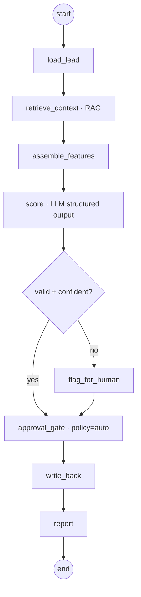

# Digital Edify — Lead Scoring Agent: LangGraph Design

**Version:** 1.0 · First real agent (Phase 1, ticket family after Phase 0) · Companion to 06 Phase 0 Backlog
**Why this one first:** read-only-ish (it writes a score, not an outbound message), high-volume, easy to evaluate against historical conversion outcomes — the lowest-risk way to prove the agent pattern end-to-end.

---

## 1. Responsibility

Given a lead, produce a **calibrated score (0–100), a band (hot/warm/cold), human-readable reasons, and a recommended next action** — then write that back to the record, emit a timeline event, and report to the feed. It never contacts the lead; that's the Outreach agent's job (built next, with a real human approval gate).

---

## 2. The graph



- **Checkpointed** at every node (Postgres) → resumable and observable.
- **Traced** in LangSmith (each node = a span with inputs/outputs/cost).
- The **approval gate is present but policy=`auto`** for scoring (low-risk). It's wired so that flipping the policy to `supervised` later requires zero code change — the same node simply pauses. This teaches the pattern without blocking a high-volume job.

---

## 3. State

```python
from typing import TypedDict, Literal, Optional
from pydantic import BaseModel, Field

class ScoreResult(BaseModel):
    score: int = Field(ge=0, le=100)
    band: Literal["hot", "warm", "cold"]
    reasons: list[str] = Field(max_length=5)       # short, human-readable
    recommended_action: Literal[
        "call_now", "send_syllabus", "nurture", "disqualify"
    ]
    confidence: float = Field(ge=0, le=1)

class LeadScoringState(TypedDict):
    # context
    tenant_id: str
    user_id: str                 # the human the agent acts on behalf of
    work_item_id: str
    run_id: str
    # working memory
    lead: dict                   # work_item + lead + party
    recent_activity: list[dict]
    features: dict               # structured signals
    context_chunks: list[dict]   # RAG hits
    # output
    result: Optional[ScoreResult]
    needs_human: bool
    error: Optional[str]
```

---

## 4. Nodes

### 4.1 `load_lead` — entity memory
Fetch the `work_item` + `lead` extension + `party` + last *N* `activity` rows (calls, messages, webinar attendance, syllabus opens). All tenant-scoped via RLS. No model call.

### 4.2 `retrieve_context` — semantic memory (RAG)
Embed a compact lead descriptor (source, program interest, recent interactions) and query the `embedding` table for:
- **outcome exemplars** — similar past leads and whether they converted (object_type=`lead_outcome`), and
- **playbook guidance** — ICP / qualification notes (object_type=`kb_article`).

Filter by `tenant_id` + `object_type`, top-k (e.g., 5). This grounds the score in *Digital Edify's own* conversion history, not generic priors.

### 4.3 `assemble_features` — structured signals
Deterministic feature dict (no model): lead source, city tier, program fit, recency/frequency of engagement, Vimeo watch %, webinar attendance, response latency, advisor notes flags. Keeping these explicit makes scores explainable and eval-stable.

### 4.4 `score` — the model call
Small/fast model (Gemini Flash or small OpenAI) via the LLM gateway, low temperature, **structured output validated against `ScoreResult`**. Prompt shape:

- *System:* "You score Digital Edify enrolment leads. Use ONLY the provided features and context. Output JSON matching the schema. Reasons must cite specific signals."
- *User:* serialized `features` + `context_chunks` (exemplars + playbook) + the schema.

Gateway enforces JSON-schema validation; a parse/validation failure routes to retry-once, then `needs_human=True`.

### 4.5 `valid + confident?` — guard
If schema-valid **and** `confidence ≥ threshold` (e.g., 0.6) → proceed. Else → `flag_for_human` (sets `needs_human`, leaves score provisional). This is the cheap safety valve that keeps low-quality scores from acting like high-quality ones.

### 4.6 `approval_gate` — policy hook (auto for scoring)
Looks up `approval_policy(tenant_id, action='write_score')`. Default `auto` → pass straight through (but still audited). If an org sets it `supervised`, the node pauses, writes an `approval` row, emits `needs_approval`, and resumes on decision — **same code, different policy row.**

### 4.7 `write_back` — durable, idempotent
- Update `lead.score`, `lead.score_reason` (concise text from `reasons`).
- Set `work_item.attributes.band` and `priority` (hot→1).
- Insert `activity` (verb=`scored`, payload = full `ScoreResult` + feature snapshot).
- Insert `audit_log` (actor_type=`agent`, actor_id=`lead_scoring`, model used, input hash, on-behalf-of `user_id`).
Idempotent on `(run_id)` so a resumed run doesn't double-write.

### 4.8 `report`
Finalize the `agent_run` (status, finished_at, steps), emit the `result` to the feed over SSE. If `needs_human`, the feed item is a review prompt rather than a silent score.

---

## 5. Graph wiring (sketch)

```python
from langgraph.graph import StateGraph, START, END
from langgraph.checkpoint.postgres import PostgresSaver

def build_lead_scoring_graph(checkpointer: PostgresSaver):
    g = StateGraph(LeadScoringState)
    g.add_node("load_lead", load_lead)
    g.add_node("retrieve_context", retrieve_context)
    g.add_node("assemble_features", assemble_features)
    g.add_node("score", score)
    g.add_node("flag_for_human", flag_for_human)
    g.add_node("approval_gate", approval_gate)
    g.add_node("write_back", write_back)
    g.add_node("report", report)

    g.add_edge(START, "load_lead")
    g.add_edge("load_lead", "retrieve_context")
    g.add_edge("retrieve_context", "assemble_features")
    g.add_edge("assemble_features", "score")
    g.add_conditional_edges(
        "score",
        lambda s: "ok" if (s["result"] and s["result"].confidence >= 0.6) else "review",
        {"ok": "approval_gate", "review": "flag_for_human"},
    )
    g.add_edge("flag_for_human", "approval_gate")
    g.add_edge("approval_gate", "write_back")
    g.add_edge("write_back", "report")
    g.add_edge("report", END)

    return g.compile(checkpointer=checkpointer)
```

Each node is a `(state) -> partial_state` function. The graph is invoked with `config={"configurable": {"thread_id": run_id}}` so checkpointing + resume key off the `agent_run.run_id`.

---

## 6. Evaluation (the CI gate)

Scoring is uniquely easy to evaluate because **history tells you the truth.**

**Dataset:** a frozen set of historical leads with known outcomes (converted / not), tenant-scoped, PII-stripped.

| Metric | What it checks | Gate |
|---|---|---|
| **Ranking quality** (AUC / precision@k) | Do higher scores actually convert more? | must not regress vs baseline |
| **Schema validity** | 100% outputs match `ScoreResult` | hard 100% |
| **Reason quality** (LLM-judge rubric) | Are reasons specific + grounded in features? | ≥ threshold |
| **Calibration** | Does "hot" convert markedly more than "warm"? | bands monotonic |
| **Latency / cost per score** | Stays within budget | ceilings |

Wire into CI (ticket DE-061): any regression in ranking or a drop below 100% schema validity **fails the build**. This is what lets you change the prompt/model later without fear.

---

## 7. Build tickets (Phase 1 — follows Phase 0)

| ID | Ticket | Deps (Phase 0) |
|---|---|---|
| DE-100 | Seed `embedding` with lead-outcome exemplars + playbook chunks | DE-026, DE-033 |
| DE-101 | Implement `load_lead` + `assemble_features` (+ unit tests) | DE-032 |
| DE-102 | Implement `retrieve_context` (RAG over PgVector) | DE-100 |
| DE-103 | Implement `score` node + `ScoreResult` schema + gateway validation | DE-033 |
| DE-104 | Wire graph + checkpointer + conditional review edge | DE-050 |
| DE-105 | `write_back` (idempotent) + activity + audit | DE-024, DE-052 |
| DE-106 | Feed rendering of scores + review prompts | DE-042 |
| DE-107 | Eval dataset + metrics + CI gate for scoring | DE-061 |

---

## 8. How it reuses Phase 0 (nothing rebuilt)

The Lead Scoring agent slots into the rails from Phase 0 unchanged: the **LangGraph runtime + checkpointer** (DE-050), the **approval gate** (DE-052), the **SSE feed** (DE-051/042), the **LLM gateway** (DE-033), the **data model + RLS** (Epic C), and the **eval gate** (DE-061). It only adds *its own* nodes and dataset. That is the proof of the platform thesis at the smallest scale: **the next agent (Outreach) will reuse the same rails and add only its nodes + a supervised policy row.**

---

*Net: a low-risk, highly-evaluable first agent that exercises every platform primitive — retrieval, structured generation, the approval-gate pattern, durable write-back, audit, tracing, and the eval gate — and leaves a template every later agent follows.*
