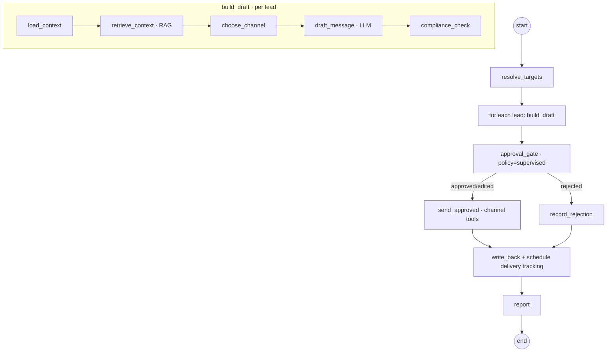
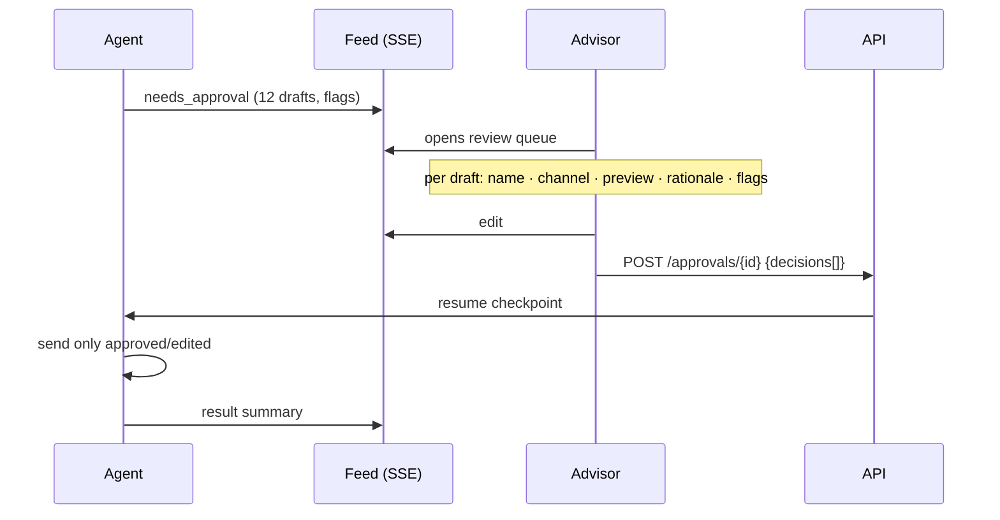

# Digital Edify — Outreach Agent: LangGraph Design

**Version:** 1.0 · Second real agent (Phase 1) · Companion to 07 Lead Scoring Agent
**Why this one next:** it's the **first agent that takes a consequential, outbound action** (messaging real leads). It exercises the things scoring didn't: a *real* supervised approval gate, message-template governance, channel consent/compliance, channel tools, and delivery tracking. Get this right and every later "acting" agent follows its template.

---

## 1. Responsibility & scope

**Does:** for a target set of leads (e.g., "follow up with this week's hot leads", "re-engage 14 cold no-shows"), draft a personalized message per lead, route it through human approval, and — only for approved items — send via the right channel, then write back and track delivery.

**Does not:** decide *who* is hot (that's the Lead Scoring agent), place autonomous phone calls (it creates a call task for an advisor instead), or send anything without passing consent + template + approval checks.

**Operates on:** `work_item` type `lead` (and later `deal`). Runs as an `agent_run`.

---

## 2. The graph



The agent **fans out** to draft per lead, then **funnels into a single approval surface** for the whole batch — the advisor reviews all drafts at once. On resume, only approved (or edited-then-approved) drafts are sent. Everything is checkpointed, so the run survives the human taking an hour to review.

---

## 3. State

```python
from typing import TypedDict, Literal, Optional
from pydantic import BaseModel, Field

class Draft(BaseModel):
    lead_id: str
    party_name: str
    channel: Literal["whatsapp", "email", "call_task"]
    template_id: Optional[str]          # required for WA outside session window
    subject: Optional[str]              # email only
    body: str
    variables: dict                     # bound template vars
    rationale: str                      # why this lead, why this message
    compliance: dict                    # {opted_in, within_session, flags[]}
    status: Literal["proposed","approved","edited","rejected","excluded"] = "proposed"

class OutreachState(TypedDict):
    tenant_id: str
    user_id: str                        # advisor the agent acts on behalf of
    run_id: str
    target_lead_ids: list[str]
    drafts: list[Draft]
    decisions: Optional[list[dict]]     # filled by the approval resume
    sent: list[dict]
    error: Optional[str]
```

---

## 4. Nodes

### 4.1 `resolve_targets`
Turn the command into a concrete lead set — either an explicit list, or a query ("hot leads not contacted in 7 days"). Tenant-scoped; caps batch size (e.g., 50) to keep approval reviewable.

### 4.2 `load_context` (per lead) — entity memory
Lead + party + last interactions + current `score`/`band` + last outbound (for frequency capping).

### 4.3 `retrieve_context` (per lead) — semantic memory (RAG)
Pull: high-performing past messages for similar leads, program facts (dates, fees, syllabus), and objection-handling snippets. Grounds personalization in real, correct content — critical to avoid hallucinated program details.

### 4.4 `choose_channel`
Pick channel by **consent + recency + history**:
- WhatsApp if opted-in; **free-form** allowed only inside the ~24h session window opened by the lead's last inbound message, otherwise an **approved template** is required.
- Email if WhatsApp not available/opted-in.
- `call_task` (an advisor to-do via Exotel click-to-call) when a human touch fits better — never an autonomous call.

### 4.5 `draft_message` — the model call
Drafting model (Claude/OpenAI) via the gateway, structured output `Draft`. Prompt: use ONLY retrieved program facts; personalize from real signals in context; respect channel length/tone; include one clear CTA; if a template is required, fill its variables rather than writing free-form. Output validated against the schema.

### 4.6 `compliance_check` — the outreach-specific guardrail
Per draft, verify and annotate `compliance`:
- **Consent / opt-in** present for the channel → else `status=excluded`.
- **WhatsApp window:** inside 24h → free-form ok; outside → must reference an **approved template**; else downgrade to template or exclude.
- **Frequency cap / quiet hours** (no over-messaging; respect local hours).
- **Fact check** program names/dates/fees against the catalog (`program`/`cohort`).
- **PII / injection** screen via the gateway.
Flags surface in the approval UI; hard violations exclude the draft before a human ever sees it as sendable.

### 4.7 `approval_gate` — **the real one (policy=supervised)**
Pauses the run, writes an `approval` row holding all proposed drafts, emits `needs_approval` over SSE. Resumes on the advisor's decision payload (see §5). This is the first place the HITL gate does real work.

### 4.8 `send_approved` — channel tools
For each `approved`/`edited` draft, call the channel tool (§6) with an **idempotency key = `{run_id}:{lead_id}`** so a resumed/retried run never double-sends. Failures are captured per-item, not fatal to the batch.

### 4.9 `write_back`
Per lead: insert `activity` (verb=`messaged`/`call_task_created`, payload=final message + channel + message_id), insert `audit_log` (actor=agent, on-behalf-of advisor, model, approver, decision), update `work_item.state` (e.g., `contacted`) and `last_contacted`. Rejections logged with reason as a learning signal.

### 4.10 `report`
Finalize `agent_run`; feed summary ("9 sent, 2 edited, 1 rejected, 2 excluded — no opt-in"). Delivery statuses arrive later via webhooks (§7).

---

## 5. Approval UX (the human surface)

The feed item expands into a **batch review queue** — the single most important UX in the product, because it's where trust is built.



Each row shows: **lead name + band**, **channel + template** (or "free-form, in session window"), **message preview**, **why this lead** (rationale), and any **compliance flags**. Controls:

- **Approve / Reject** per item, plus **Approve all**.
- **Inline edit** of any draft (edits captured as training signal — high edit rate flags a weak prompt).
- **Excluded** items shown read-only with the reason (e.g., "no WhatsApp opt-in").
- **Send timing:** now, or schedule within allowed hours.

On submit, the run resumes and acts on exactly those decisions. Nothing leaves the system that a human didn't approve.

---

## 6. Channel tool contracts (become MCP tools later)

Typed, tenant/user-scoped, audited, idempotent. All return a normalized result `{message_id, status, provider, error?}`.

| Tool | Input | Key rules |
|---|---|---|
| `send_whatsapp` | `to, template_id?, body?, variables, idem_key` | Requires opt-in; outside 24h window → `template_id` mandatory (must be `approved`); rejects free-form outside window. |
| `send_email` | `to, subject, body, idem_key` | Requires email consent; unsubscribe honored; bounce handling. |
| `create_call_task` (Exotel) | `to, lead_id, note, idem_key` | Creates an advisor task + click-to-call link; **no autonomous dialing**; consent for recording handled at call time. |

Supporting registry + consent (small additions to the data model):

```sql
CREATE TABLE message_template (
    id          uuid PRIMARY KEY DEFAULT gen_random_uuid(),
    tenant_id   uuid NOT NULL,
    channel     text NOT NULL,          -- whatsapp | email
    name        text NOT NULL,
    locale      text NOT NULL DEFAULT 'en',
    category    text,                   -- marketing | utility | service
    body        text NOT NULL,          -- with {{variables}}
    status      text NOT NULL DEFAULT 'pending', -- pending | approved | rejected
    UNIQUE (tenant_id, channel, name, locale)
);

CREATE TABLE channel_consent (
    tenant_id   uuid NOT NULL,
    party_id    uuid NOT NULL,
    channel     text NOT NULL,          -- whatsapp | email | call
    opted_in    boolean NOT NULL DEFAULT false,
    opted_at    timestamptz,
    PRIMARY KEY (tenant_id, party_id, channel)
);
```

---

## 7. Delivery tracking

Channel webhooks (WhatsApp/Exotel/email ESP) hit FastAPI receivers → normalized to `activity` updates (`sent → delivered → read → replied`). A reply inside the window reopens the WhatsApp free-form session and can trigger the next agent (e.g., Triage/Scheduler). Delivery state is visible on the record timeline and feed.

---

## 8. Autonomy: how Outreach graduates (trust ladder)

Starts fully **supervised**. With evidence in the Control Tower, graduate *narrowly*:

```
supervised (every draft approved)
  → auto-send ONLY when ALL of: approved template + opted-in + inside policy hours + band=hot + advisor approval-acceptance > threshold over N cycles
  → free-form drafts remain supervised
```

Promotion is per-condition and reversible — any compliance flag or a drop in acceptance demotes it instantly. Policy lives in `approval_policy`, so graduation is a config change, not a code change.

---

## 9. Evaluation (CI gate)

| Metric | Checks | Gate |
|---|---|---|
| **Draft quality** (LLM-judge rubric) | personalization from real signals, correct program facts, on-brand tone, single clear CTA, length | ≥ threshold |
| **Factual correctness** | program names/dates/fees match catalog | hard — zero fabricated facts |
| **Compliance correctness** | never proposes sendable draft for non-opted-in / non-approved-template-outside-window | hard 100% |
| **Schema validity** | outputs match `Draft` | hard 100% |
| **Edit rate** | proxy for draft usefulness | tracked; rising trend fails review |
| **Post-launch (A/B)** | reply rate, demo-booking rate vs control | monitored, not a CI gate |

Wired into CI alongside the scoring evals. A compliance or factual regression **fails the build**.

---

## 10. Build tickets (Phase 1, after Lead Scoring)

| ID | Ticket | Deps |
|---|---|---|
| DE-200 | `message_template` + `channel_consent` tables + seed approved templates | DE-024 |
| DE-201 | `send_whatsapp` tool (opt-in + window + template logic, idempotent) | DE-200, DE-033 |
| DE-202 | `send_email` + `create_call_task` (Exotel) tools | DE-200 |
| DE-203 | `resolve_targets` + per-lead `load_context`/`retrieve_context` | DE-102 |
| DE-204 | `draft_message` + `Draft` schema + gateway validation | DE-033 |
| DE-205 | `compliance_check` node (consent, window, freq cap, fact check) | DE-200, DE-204 |
| DE-206 | Graph wiring + checkpointer + fan-out/funnel | DE-104 |
| DE-207 | **Approval review-queue UI** (per-item approve/edit/reject, approve-all, flags) | DE-042, DE-052 |
| DE-208 | `send_approved` + `write_back` + idempotency | DE-201, DE-202, DE-052 |
| DE-209 | Delivery-status webhooks → `activity` | DE-024 |
| DE-210 | Outreach eval suite + CI gate | DE-061 |

---

## 11. Reuse vs. genuinely new

**Reused from Phase 0 + Scoring (nothing rebuilt):** LangGraph runtime + checkpointer, the approval-gate mechanism, SSE feed, LLM gateway, data model + RLS + audit, eval harness.

**Genuinely new (and reusable by every later acting agent):** channel tools (WhatsApp/Exotel/email), the message-template registry + governance, channel consent, the **batch approval review-queue UI**, and delivery-status tracking. The Scheduler, Triage, and every future "acting" agent inherit all of this — they add only their own nodes and a policy row.

---

*Net: Outreach is the first agent that acts on the world. Its design makes the human approval surface excellent, makes consent/template/fact compliance non-bypassable, and makes sending idempotent and audited — establishing the pattern (and the reusable channel + approval machinery) that every subsequent acting agent builds on.*
